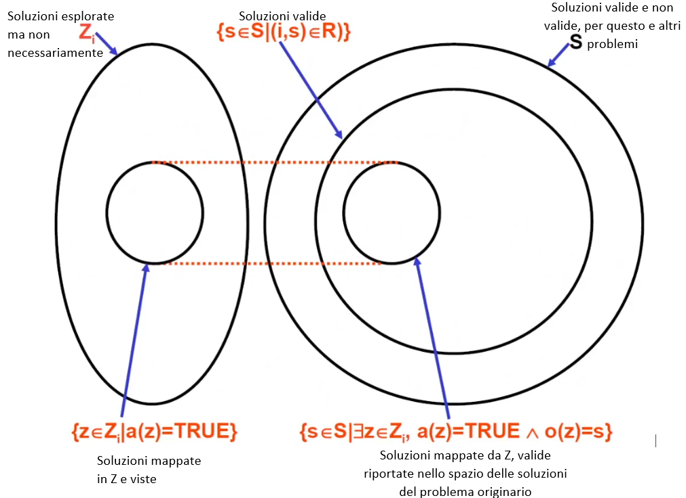
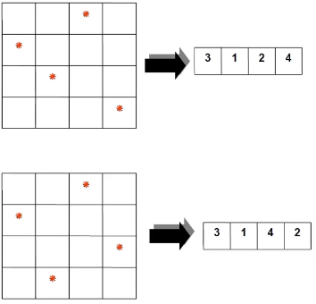

- **DEFINIZIONE**: strumento che aiuta a definire le potenziali soluzioni ad una generica istanza di un problema, per orientare la scelta di un algoritmo
	- ISTANZA
	  id:: 63cac541-d24a-4523-9faa-e9d4cfe08adc
		- una determinata configurazione dell'input
	- si definirà dove andare a guardare con un certo algoritmo
	- lo spazio di ricerca non sempre corrisponde all'intero spazio delle soluzioni per quell'istanza
- **SPECIFICA DI UN PROBLEMA**: definisce la struttura del problema indipendentemente dal modo in cui il problema verrà risolto
- **SPAZIO DELE SOLUZIONI**: è caratteristica intrinseca del problema e non fornisce indicazioni sulle soluzioni per una generica istanza
- {:height 389, :width 515}
- ## Definizione dello spazio di ricerca
	- significa stabilire un metodo che per ogni ((63cac541-d24a-4523-9faa-e9d4cfe08adc)) (*i*) di un problema *P* definisce un insieme di 2 funzioni associate:
		- **funzione di ammissibilità**: permette di verificare se un elemento dello spazio di ricerca corrisponde ad una soluzione per *i*;
		- **funzione di risposta**: dagli elementi dello spazio di ricerca ottiene le corrispondenti risposte per *i*
			- IN ALTRE PAROLE: mappa la funzione all'output
	- DEFINIZIONE FORMALE:
		- data un'istanza *i* di un problema,  P=<I, S, R, S∪{⟂}, Q>
		- uno spazio di ricerca è costituito da:
			- un **insieme Z_{i}** con associate due funzioni:
				- funzione di ammissibilità: a:Z_{i}-->{TRUE, FALSE}
					- si legge: la funzione a prende in input un elemento *i* dell'insieme *Z* e restituisce  TRUE o FALSE
				- funzione di risposta: o: Z_{i}-->s
				- che soddisfano le seguenti condizioni:
					- 1. per ogni elemento z di Z_{i} a(z)=TRUE se e solo se o(z) è soluzione di P per *i*
					  2. *i* ha risposta positiva **se e solo se** vi è almeno un elemento z di Z_{i} per cui a(z)=TRUE e o(z) è una risposta a P per I
			- un **metodo**: per rappresentare ogni elemento di Z_{i} mediante una struttura di dati (vettore, matrice, lista, albero, ...) e per esprimere la funzione di ammissibilità e di risposta in termini di tale struttura
- ## Spazio di ricerca per un problema P
	- lo spazio di ricerca:
		- **DEVE**
			- caratterizzare le soluzioni ad un'istanza in modo non ridondante
			- è necessario scegliere una struttura dati che escluda configurazioni che non corrispondono ad alcuna soluzione
				- ad esempio è possibile rappresentare la matrice del ((63cad4e9-82c5-452d-b886-350bbf49e5a6)) , con un vettore dove ogni posizione corrisponde ad una riga e in ogni cella c'è la posizione della verticale. In questa maniera è impossibile rappresentare per la stessa riga 2 o più verticali, violando quindi le condizioni del problema, (ovviamente in questa maniera non è evidente se ci sono conflitti sulle diagonali, si può risolvere con una formula che è: |V[h]-V[k]| = |h-k|)
			- fornire elementi significativi per la comprensione della struttura del problema e delle sue soluzioni
		- **NON DEVE**
			- riformulare il problema e la sua relazione caratteristica
			- nascondere difficoltà di un problema
	- **ESEMPIO del problema delle n regine:**
	  id:: 63cad4e9-82c5-452d-b886-350bbf49e5a6
		- **spazio di ricerca**: coincide con tutti i possibili modi di memorizzare i valori da 1 a i, in un vettore V con *i* elementi (tutte le possibili permutazioni di (1,...,i))
		- **funzione di ammissibilità**: verifica se un elemento dello spazio di ricerca, in questo caso il vettore V, non contiene 2 celle in posizioni **h** e **k** tali che |V[h]-V[k]| = |h-k| (2 regine sulla stessa diagonale)
			- rappresentazione con vettore: {:height 202, :width 202}
		- **funzione di risposta**: ricostruisce a parte da un vettore, la configurazione della scacchiera
- lezione 30.01 dall'inizio a minuto 3300
  background-color:: red