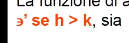
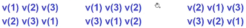
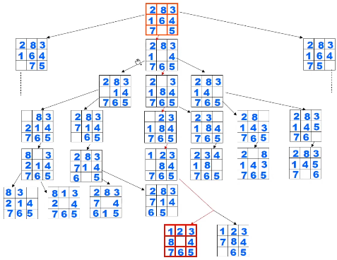

- {{embed ((63cae555-f7e9-412e-b5e3-d41f2bf436bd))}}
- ## Tecnica enumerativa
	- {{embed ((63cae537-8e96-4dee-a286-e10918d0c4ca))}}
	- si basa sulla sistematica ispezione, elemento per elemento, dello spazio di ricerca di una data istanza di un problema, **garantisce** la **terminazione** se lo spazio di ricerca è finito
	  background-color:: yellow
	- #+BEGIN_NOTE
	  Lo spazio di ricerca è generato da tutte le possibili configurazioni dell'input
	  #+END_NOTE
		- **Terminazione in problemi di ricerca**:
			- trova un elemento ammissibile
			- esaurimento dello spazio di ricerca
		- **Terminazione in problemi di ottimizzazione**:
			- esaurimento dello spazio di ricerca perché deve necessariamente confrontare tutti gli elementi ammissibili
		- **la visita sistematica di uno spazio di ricerca** si realizza
			- imponendo una relazione di ordinamento totale sullo spazio di ricerca in modo da associare ad *i* lo spazio *Z_{i}*
			- un metodo per stabilire il **primo** elemento da considerare
			- un metodo per stabilire l'elemento **successivo**
			- un metodo per verificare **se tutti gli elementi sono esaminati**
	- **Complessità computazionale**: O(n!)
- ## Esempio ordinamento vettore di interi
	- ordinare un vettore di interi secondo l'ordine non decrescente dei suoi elementi
		- **V** vettore da ordinare
		- **spazio di ricerca**: costituito dalle permutazioni di V
		- **funzione di ammissibilità**: verifica che non esistano permutazioni se , sia **V(h) < V(k)**
		- **funzione di risposta**: è l'identità CHE MINCHIA E' L'IDENTITA'?
		  background-color:: red
		- se **n** è la dimensione di **V** allora lo spazio di ricerca ha dimensione **n!** (n fattoriale)
			- sia il vettore v(1), v(2), v(3), i possibili ordinamenti sono:
			- 
		- **SOLUZIONE CON ALG. SELETTIVO**:
			- prima genera tutte le permutazioni o le ha già a disposizione
			- inizia la ricerca su tutto lo spazio
			- #+BEGIN_NOTE
			  Questo algoritmo in realtà non necessita di cercare su tutto lo spazio, è sufficiente che individui 2 interi nel giusto ordinamento, quindi può "selezionare" una delle soluzioni con il successivo intero che corrisponde alla relazione. 
			  
			  In pratica l'algoritmo esplora lo spazio di ricerca come se si trovasse in un albero
			  #+END_NOTE
- ## Esempio problema di ricerca - gioco dell'8
  collapsed:: true
	- OBIETTIVO: trovare una **sequenza** di mosse per disporre i tasselli ordinatamente sui bordi
	- 
	- #+BEGIN_NOTE
	  Questo è un problema di ricerca perchè è richiesto di trovare una sequenza (va bene anche se lunga); se dovesse essere di ottimizzazione sarebbe dovuto essere di trovare la sequenza più breve possibile
	  #+END_NOTE
- ## Esempio problema di ottimizzazione - gioco dell'8
  collapsed:: true
	- OBIETTIVO: trovare la **più breve sequenza** di mosse per disporre i tasselli ordinatamente sui bordi