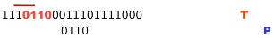
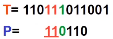
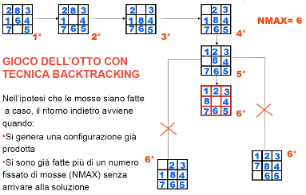

- ## Basics
	- la generazione degli elementi dello **spazio di ricerca** da visitare avviene per stadi
		- ogni elemento è composto da diverse componenti scelte ad ogni stadio
	- in questa soluzione è possibile costruire la soluzione per stadi quindi è possibile capire **se la soluzione parziale è fallimentare abbandonando la costruzione** e tentando altre vie
	- #+BEGIN_NOTE
	  non sempre è possibile strutturare le soluzione per stadi
	  #+END_NOTE
- ## Problema dello string matching
	- trovare un pattern P di *m* caratteri in un'altra sequenza di testo T di *n* caratteri.
	- le stringe P e T sono formate da caratteri trattati dallo stesso alfabeto ed *m* non supera *n*
	- 
	- **Soluzione 1: O(m*n)**
		- cercare di riconoscere il pattern sin dal primo carattere di **T**
		- se non riconosciuto si ripete la procedura di riconoscimento dal 2 carattere e così via sino ad esaurimento del testo
		- #+BEGIN_NOTE
		  questo è un algoritmo di backtraking perchè il riconoscimento avviene per passi e in caso di errore i risultati degli stadi vengono scartati
		  #+END_NOTE
	- **Soluzione 2 algoritmo di Knuth-Morris-Pratt: O(n+m)**
		- trae vantaggio dai confornti già fatti sul pattern, infatti se:
			- T = 110111011001
			- P = 110110
		- i primi 5 caratteri di P sono uguali ai primi 5 di T, il resto è diverso
		- al momento del primo backtrack risulta i=j=6 e ripartire con i=2 e j=1 corrisponde a traslare di una posizione il pattern rispetto al testo
			- *i* indice di T
			- *j* indice di P
		- in questo caso visto che solo l'ultimo carattere (il 6) non combacia vale la pena ripartire dai primi 2 caratteri di P e degli ultimi 2 caratteri di T, quindi impostare gli indici i=6 e j=3
			- 
- ## Albero di ricerca
	- dato un problema P e un metodo per associare le istanze di P con uno spazio di ricerca Z_{i}
	- dato un modo per strutturare ogni elemento di Z_{i} in un numero finito di componenti
	- l'albero di ricerca associato all'istanza tramite Z_{i} è un albero tale che:
		- la radice rappresenta una soluzione parziale fittizia
		- ogni nodo tra la radice e le foglie è una soluzione parziale dove ci sono le prime componenti di *j*
		- l'albero ha tanti figli quanti sono i modi possibili di aggiungere ad S la j+1 esima componente
		- ogni foglia è un elementi di Z_{i}
	- **Esempio gioco dell'8 con tecnica backtraking**
		- 
		- #+BEGIN_NOTE
		  questo è un ((63c830b3-c99f-49ff-855e-92d3763155aa)) perchè è richiesto di trovare un percorso in **nmax** passaggi
		  
		  NON è di OTTIMIZZAZIONE perchè non è stato chiesto di trovare il miglior percorso possibile
		  #+END_NOTE
- ## Problema del partizionamento di un insieme
	- dato un insieme di numeri interi positivi la cui somma è 2M, si vuole sapere se esiste un sottoinsieme di Y la cui somma sia M
		- **Y**={8, 5, 1, 4}
		- **OBIETTIVO**: cercare un sottoinsieme X la cui somma è 9
		- **ALGORITMO**:
			- 1. rappresentare l'insieme in un vettore
			  2. generare per stadi il vettore soluzione aggiungendo un intero alla volta
			- **NOTA**: rispetto all'enumerazione non si devono generare tutte le configurazioni possibili