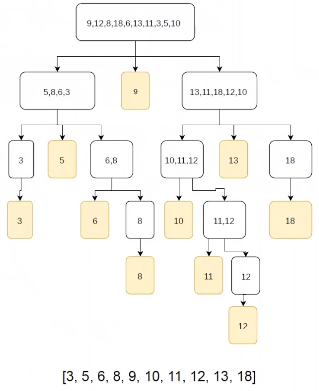

- ## Basics
	- ((63cae559-9c35-4a86-a778-73fcd4f29fd3))
	- fa uso della **decomposizione induttiva** per determinare il metodo solutivo
	- decompone un problema complesso in sottoproblemi più semplici, successivamente le soluzioni ottenute devono essere ricomposte
	- **COSTI**:
		- la complessità dipende:
			- dal numero di sottoproblemi generati
			- dalla dimensione dei dati in ingresso ai sottoproblemi
			- complessità di decomposizione e ricomposizione
		- generalmente hanno prestazioni migliori rispetto ad altri algoritmi (tipicamente a quelli del paradigma selettivo)
- ## Algoritmo generale
  collapsed:: true
	- se l'input ha dimensione ad un valore *k* allora usa il metodo diretto per ottenere il risultato
	- altrimenti **DIVIDE** l'input in parti, ognuna di dimensione inferiore all'input originario
	- esegui ricorsivamente l'algoritmo su ciascuno degli input
	- **IMPERA** ricomponi i risultati per ottenere il risultato per l'istanza originaria
	- ESEMPI: natural merge sort, quicksort, ricerca binaria (ma senza IMPERA)
- ## Esempio problema del minimo e massimo simultanei
  collapsed:: true
	- trovare il minimo e il massimo di un insieme di *n* elementi simultaneamente
	- cercando il minimo e il massimo in modo indipendente ci vorrà un totale di **2(n-1)** confronti
	- mantenendo gli elementi minimo e massimo via via incontrati e confrontando i due elementi della coppia in input sono sufficienti **3(n/2)** confronti
	- **ALGORITMO**:
		- se la dimensione del vettore non supera 2 elementi, allora calcola direttamente, con un solo confronto il min e max
		- altrimenti:
			- dividi il vettore in due sottovettori di dimensione uguale
			- calcola ricorsivamente
				- il minimo **min_{1}** e il **max_{1}** del primo sottovettore
				- il minimo **min_{2}** e il **max_{2}** del secondo sottovettore
		- determina il min e max del vettore complessivo confrontando **min_{1}** con **min_{2}** e **max_{1}** e il **max_{2}**
	- **COMPLESSITA'**:
		- divide: costo quasi 0
		- impera: 2 confronti (1 per mi e 1 per max); Costante
- ## Esempio quick sort
	- la versione ricorsiva è basata su tecnica divide et impera
	- l'idea è quella di selezionare un elemento detto pivot
	- attorno al pivot gli elementi vanno sistemati in modo tale che tutti quelli più piccoli si trovano alla sinistra del pivot e tutti quelli più grandi alla destra ottenendo così 2 partizioni
		- non è necessario che le due partizioni al loro interno siano ordinate
	- la procedura quicksort viene richiamata ricorsivamente sulle due partizioni create
	- il passo base coincide con la partizione di lunghezza uno
	- 
	- **COMPLESSITA'**:
		- CASO MEDIO: ottima per il problema di ordinamento O(nlogn)
		- CASO PESSIMO: O(n^{2}) nel caso di elementi già ordinati e primo elemento come pivot
		- si può migliorare l'algoritmo migliorando la scelta del pivot
			- scegliere il mediano tra A[1], A[n] e A[n/2]: lo scambio con il primo elemento va effettuato prima della chiamata di PARTIZIONA