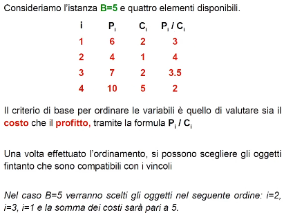
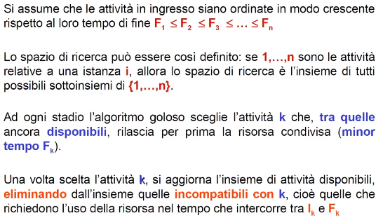
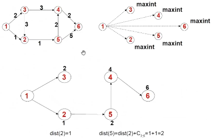

- ## BASICS
  collapsed:: true
	- ((63cae559-9c35-4a86-a778-73fcd4f29fd3))
	- sempre tentare prima la strada del generativo, se non è possibile si possono usare altri paradigmi e relative tecniche
	- #+BEGIN_TIP
	  - da utilizzarsi principalmente in problemi di ottimizzazione
	  - utilizzabile quando il problema è talmente complesso da essere intrattabile, quindi ci si accontenta di una soluzione non ottima in tempi utili
	  #+END_TIP
	- è possibile usare un algoritmo **greedy** per un **problema di ottimizzazione** se si verificano queste proprietà tra loro correlate:
		- **proprietà della scelta greedy**:
			- assicura che si può ottenere una soluzione ottima globalmente prendendo decisioni ottime localmente
				- IN ALTRE PAROLE: dato un problema di dimensione *n* se si prende una decisione, dopo si riconduce ad un problema n-1, se la soluzione è uguale per entrambe inclusa la scelta greedy (per il problema *n*), significa che si è presa la scelta ottima
		- **proprietà della sottostruttura ottima**:
			- se la soluzione ottima contiene una soluzione ottima per i suoi sottoproblemi
				- IN ALTRE PAROLE prendendo il problema dello zaino, una sottostruttura ottima si ottiene con la dimensione del problema n (prob originale) e per problemi <n (sottoproblema)
	- **PRO**: molto più rapida rispetto alle altre tecniche selettive
	- **CONTRO**:
		- potrebbe essere meno accurata rispetto alle altre tecniche selettive nel senso che:
			- si potrebbe trovare una soluzione non ottima
			- potrebbe non essere trovata una soluzione nonostante esista
- ## PPRINCIPIO DI FUNZIONAMENTO
  collapsed:: true
	- permette di ottenere soluzioni in base ad una sequenza di decisioni
	- **per ogni passo si prende una decisione che in quel momento sembra migliore**
		- ad ogni stadio *i* per la componente i-esima viene scelto un valore tra quelli ammissibili che risulta migliore rispetto ad un **criterio**
		- dopo la scelta si considerano le altre **senza tornare sulle scelte fatte prima**
	- requisito fondamentale è quello che l'algoritmo deve acquisire la rappresentazione di un'istanza del problema, poi deve disporre di un **metodo per organizzare** la costruzione in stadi di un elemento dello spazio di ricerca (Z)
		- #+BEGIN_WARNING
		  il **criterio** influenza pesantemente l'efficienza di questo algoritmo
		  #+END_WARNING
- ## ALGORITMO
	- 1. i=1 e inizializza z
	  2. determinare l'insieme A dei valori ammissibili per la componente i-esima di z e se A è ancora pieno scegli il miglior valore di A rispetto ad un **criterio**
	  3. se l'i-esimo stadio è l'ultimo allora termina e restituisci l'output o(z)
- ## COSTI
	- ordinamento: O(n* log_{n})
	- selezione dell'oggetto: O(n)
	- calcolo profitto/costo: O(n)
	- **asintoticamente** O(n * log_{n})
- ## Esempio problema dello zaino
  collapsed:: true
	- si dispone di un budget B e si deve massimizzare la rendita scegliendo *n* possibili investimenti
	- ogni investimento si compone di un profitto P e un costo C_{i}
	- **CRITERIO**:
		- ordinare gli oggetti in ordine crescente rispetto il rapporto profitto-costo
		- sommare i risultati dei rapporti che devono essere complessivamente <=**B** (budget)
	- 
	- **COSTI**:
		- asintoticamente O(n*log_{n}), composto da:
			- Ordinamento: O(n*log_{n}) (costo standard per un buon algoritmo di ordinamento)
			- Rapporto P_{i}/C_{i}:  O(n)
- ## Esempio problema di selezione di attività
	- 
	- il problema è quello di assegnare una risorsa condivisa ad un certo numero di attività in competizione tra loro
	- sia **S** un insieme di attività che devono utilizzare una determinata risorsa
	- sia **k** una generica attività che si compone di:
		- **I_{k}**: tempo di inizio (attivazione)
		- **F_{k}**: tempo di fine (conclusione)
		- con **I_{k}<=F_{k}**
	- le due attività *k* e *j* sono compatibili se gli intervalli [I_{k}, F_{k}] e [I_{j}, F_{j}] non si sovrappongono
	- **OBIETTIVO**: trovare un insieme che contiene il massimo numero di attività compatibili
	- **SOLUZIONE**:
		- 1. ordinare in maniera crescente le attività per tempo di FINE
		  2. ad ogni stadio si sceglie l'attività **k** tra quelle disponibili che rilascia prima la risorsa (minor tempo F_{k})
		  3. dopo aver scelto l'attività *k*, si aggiorna l'insieme di attività disponibili, eliminando quelle incompatibili con *k* 
		        quelle eliminate sono quelle che richiedono l'uso della risorsa nel tempo che intercorre tra *I_{k}* e *F_{k}*
	- **COMPLESSITA'**:
		- OTTIMO: un'attività che inizia prima di tutte e finisce prima di tutte O(n)
		- PESSIMO: attività tutte compatibili, non si elimina niente, O(n^{2})
		- fare solo una scansione assumendo di avere attività ordinate per tempo di fine, compl O(nlog_{n})
		- il problema è che se la prima attività selezionata è quella che ha tempo maggiore di esecuzione rischia di bloccare tutte le altre
- ## Esempio problema del percorso più breve in un grafo
	- dato un grafo orientato etichettato negli archi G=(N,A), con interi positivi
	- dato un nodo *r*∈N, ∀ nodo *u*∈N, trovare la lunghezza del percorso più breve che connetta *r* ad *u*
	- **Esempio**: se i nodi sono le città, gli archi sono le strade, trovare il percorso più breve da città A verso B
	- **INGREDIENTI**:
		- **S**: insieme dei nodi, ad un certo istante, di cui **si è già calcolata la lunghezza del cammino minimo** da *r*
		- **dist**: vettore con numero di elementi pari ai nodi del grafo, dove:
			- *disti(i)* rappresenta la lunghezza del **cammino minimo** tra quelli che vanno da *r* a *i* passando solo per i nodi contenuti in **S** (a parte *i* stesso)
	- **IPOTESI**:
		- le distanze sono rappresentate da interi positivi
	- **SOLUZIONE**:
		- ordinare in ordine crescente la lunghezza dei cammini minimi da *r* a tutti i nodi del grafo
		- calcolare tutti i cammini minimi da *r* a tutti i nodi del grafo
		- ordinare in maniera crescente la lunghezza dei cammini calcolati
		- **Rappresentazione dell'albero di copertura**:
			- si genera un albero **T** che ha come radice il nodo *r*, che include un cammino da *r* ad ogni altro nodo
			- l'albero può essere rappresentato ((63c14954-6ecd-427d-8b54-f796fd9f36e9)), inizializzato come albero fittizio in cui tutti i nodi sono figli di *r* connessi ad un arco fittizio etichettato con un valore maggiore di tutte le altre etichette (MAXINT)
			- 
		- **ALGORITMO DI DIJKSTRA**
			- se la srtuttura **S** è una coda con priorità
			- in questo caso, le operazioni *leggi* e *cancella* sono gli operatori basici disponibili nell'algebra della coda con priorità:
				- **min**:                 (prioricoda) --> tipoelem
				- **cancellamin**:  (prioricoda) --> prioricoda
			- gli elementi della coda con priorità sono i nodi del grafo e le priorità associate sono le **distanze** dal nodo di origine *r*. Ad ogni iterazione è estratto da S il nodo avente priorità (distanza) minima
	- cammini
		- guardare in S, si prende un nodo