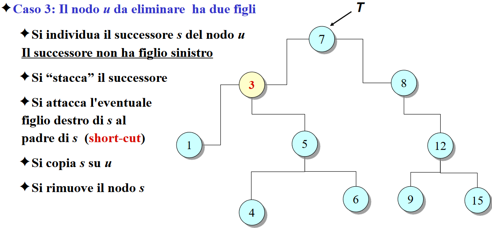

- ## Basics
  collapsed:: true
	- sono a tutti gli effetti #[[ASD albero binario]] ottimizzato ed orientato alla ricerca
	- **IDEA DI BASE**:
		- sfruttare la ricerca binaria (sulla chiave) in un albero
		- ottenere complessità logartirmica
- ## Definizione
  collapsed:: true
	- Ogni nodo *u* contiene la coppia chiave *u.key* associata ad un valore *u.value*
	- Le **chiavi** appartengono ad un insieme **totalmente ordinato**
- ## Proprietà
  collapsed:: true
	- Queste 2 consentono la realizzazione della ricerca dicotomica (binaria)
		- 1. le chiavi dei nodi del **sottoalbero sinistro** di *u* sono **minori** di *u.key*
		  2. le chiavi dei nodi del **sottoalbero destro** di *u* sono **maggiori** di *u.key*
	- 
	- ordinamento delle chiavi applicando una visita ((63c1507b-7119-41fa-afbd-a3284f3b2449))
- ## Considerazioni sui costi della ricerca
  id:: 63c181f6-7f45-4965-8fa0-e3573101a80b
  collapsed:: true
	- la ricerca è avvantaggiata da un corretto bilanciamento dei valori (tutti i livelli pieni sia a SX che DX)
		- più è ampio meglio è
		- più è alto peggio è
- ## Dizionari
  collapsed:: true
	- **Dizionario (tabelle hash)**
		- insieme dinamico che implementa le seguenti funzionalità
			- *item lookup (item k)*
			- *insert (Item k, Item v)*
			- *remove (Item k)*
		- PRO:
			- complessità costante per verifica appartenenza, aggiunta, cancellazione, ottenimento valore da chiave
- ## Implementazioni
  collapsed:: true
	- 
	- In generale per tutte le implementazioni ogni nodo è composto da:
		- figlio sinistro, figlio destro
		- padre
		- chiave
		- valore
	- **array ordinato**
	  collapsed:: true
		- COSTI
			- Ricerca: costo O(log n)
			- Inserimento: O(n)
			- cancellazione: O(n)
	- **lista non ordinata**
	  collapsed:: true
		- COSTI
			- ricerca: O(n)
			- cancellazione: O(n)
			- inserimento: O(1)
- ## Operazioni
	- #+BEGIN_NOTE
	  si lavora sempre su alberi
	  #+END_NOTE
	- tree key()
	- tree value()
	- tree left()
	- tree right()
	- tree parent()
	- tree lookup(Item k)
	- tree insert(Item k, Item d)
	- tree delete()
	- tree successorNode(Item T)
	- tree predecessorNode(Item T)
	- tree min()
	- tree max()
- ## Operazioni e costi
  collapsed:: true
	- **Cancellazione**: ricerca O(log_{2}n) + costante
	  collapsed:: true
		- {:height 222, :width 458}
		- {:height 220, :width 460}
		- {:height 257, :width 461}
		  collapsed:: true
			- {:height 250, :width 489}
			- **COSTO**: pari alla ricerca O(log_{2}n), aggiornamento (O(1)), rimozione e deallocazione.
			  in totale O(log_{2}n) + O(1)
			- {:height 237, :width 490}
		- **Riassumendo**
		  background-color:: yellow
		  collapsed:: true
			- CASO 1: nessun figlio
			  collapsed:: true
				- l'eliminazione della foglia non cambia la proprietà di ordine dei nodi rimanenti
			- CASO 2: solo un figlio (destro o sinistro)
			  collapsed:: true
				- se *u* è il figlio destro (o sinistro) di *p* tutti i valori nel sottoalbero di *f* sono maggiori (o minori) di *p*
				- quindi il nodo rimanente *f* può essere attaccato come figlio destro (o sinistro) di *p* esattamente al posto di *u*
			- CASO 3: due figli
			  collapsed:: true
				- il successore ((6422e26a-3d81-4b04-94a1-399b0735f84b)) *s*
					- è sicuramente maggiore di tutti i nodi del sottoalbero sinistro di *u*
					- è sicuramente minore di tutti i nodi del sottoalbero destro di *u*
				- quindi può essere sostituito a *u*
			- la complessità computazionale è confinata all'altezza dell'albero
	- **Inserimento**:
	- **Complessità media**:
	  collapsed:: true
		- dipende dall'altezza media di un albero di ricerca
		  background-color:: yellow
		- caso generale (inserimenti + cancellazione)
			- caso difficilmente trattabile
		- caso semplice: inserimenti in ordine casuale
			- si dimostra che l'altezza media è O(log n)
		- **Fattore di bilanciamento**
			- il fattore di bilanciamento β(v) di un nodo *v* è la massima differenza di altezza fra i sottoalberi di *v*
				- In altre parole: immaginando di prendere il sottoalbero SX e DX della radice si esegue la differenza tra i nodi dell'uno e dell'altro, maggiore è il valore della differenza, maggiormente l'albero è sbilanciato
			- esempio albero perfetto: β(v)=0  per ogni nodo *v*
			- comunque sono necessarie tecniche per il mantenimento bilanciato dell'albero, in particolarmente le cancellazioni mettono in crisi il bilanciamento
- ## Ricerca del minimo e massimo
  collapsed:: true
	- 
	- **MINIMO**: si deve effettuare sempre la lettura del ramo SX (log_{2} n)
	- **MASSIMO**: si deve effettuare sempre la lettura dal ramo DX (log_{2} n)
	- nota: si è preso il caso migliore possibile dove l'albero è perfettamente bilanciato
	- in buona sostanza in entrambi i casi si deve scendere fin tanto possibile ossia fino alle foglie
- ## Ricerca del successore/predecessore
	- **Definizione di successore**: il successore di un nodo *u* è il più piccolo nodo maggiore di *u*
	  id:: 6422e26a-3d81-4b04-94a1-399b0735f84b
	- **Casi**:
		- *u* ha un figlio destro
			- 
			- il successore *u* è il minimo del sottoalbero destro di *u*
			- ESEMPIO: il successore di 2 è 3
		- *u* non ha un figlio destro
			- il successore è il primo antenato *u* tale per cui *u* sta nel sottoalbero sinistro di *u'*
			- 
			- ESEMPIO: successore di 4 è 6
	- **NOTE**: cercare il successore significa cercare nei sottoalberi destri del nodo di partenza, potrebbe anche accadere che il successore non si trovi nei sottoalberi superiori al nodo di partenza
-
- ## Perchè gli ABR e non tabelle hash
	- tabelle hash complessità costante (caso ottimo): appartenenza, aggiunta, eliminazione, ottenimento valore associato ad una chiave
	- abr complessità logaritmica (ottimo): ricerca inserimento cancellazione
		- abr è meglio perché prevede ordinamento delle chiavi, unico vantaggio rispetto alle tabelle hash
			- #+BEGIN_TIP
			  indicati per gestione DBMS, condizioni di ricerca di confronto in base all'ordinamento, di minore e maggiore
			  #+END_TIP
			- es: cercare tutte le matricole da 3000 in poi
				- nell'ABR: basta andare all'indice 3000 e visitare il sottoalbero
				- nella tab hash: si devono scandire necessariamente tutte le chiavi
			-