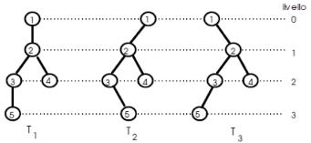
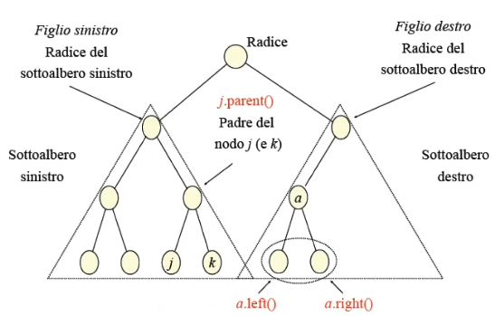
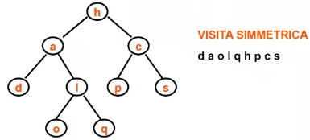
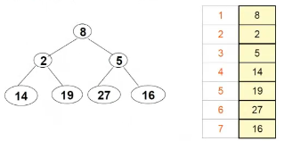
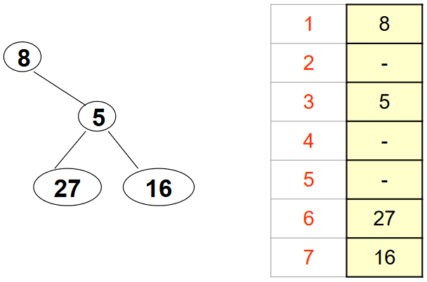
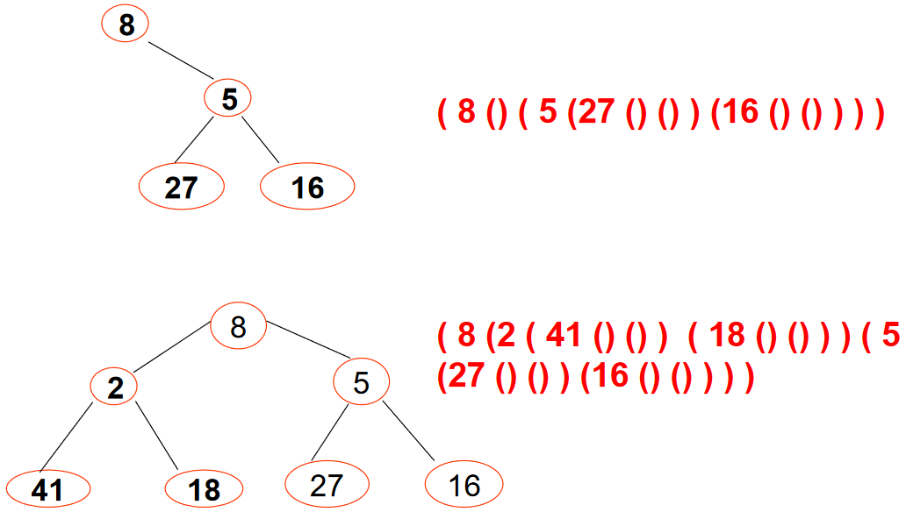
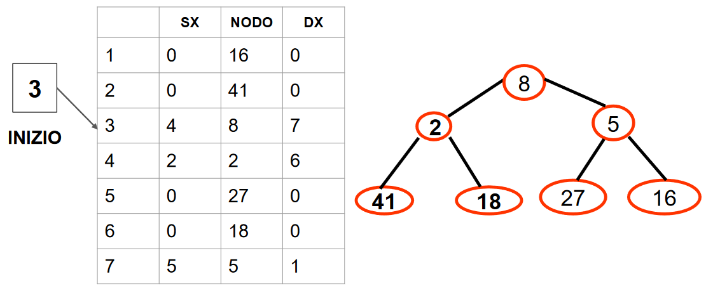
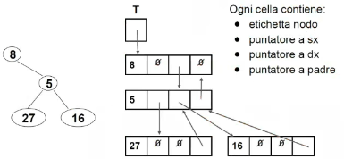

- 
  collapsed:: true
	- l'immagine mostra come un albero n-ario (T_{1}) è diverso da un albero binario, e che anche gli alberi binari apparentemente equivalenti non lo sono
	- **FORMALMENTE**: due alberi T e U aventi gli stessi nodi, figli per ogni nodo e la stessa radice, sono distinti qualora un nodo *u* sia designato come figlio sinistro di un nodo *v* in T e come figlio destro del medesimo nodo in U
-
- **DEFINIZIONE**: è un albero ordinato in cui ogni nodo ha al più **due** figli e si fa distinzione tra il **figlio destro e sinistro** di un nodo
  collapsed:: true
	- albero di ordine k=2
	- si fa distinzione tra figlio destro e sinistro, è possibile inserirne solo 1
	- la posizione dei figli conta
		- #+BEGIN_NOTE
		  negli alberi n-ari la posizione dei nodi non conta  
		  #+END_NOTE
	- 
## Equivalenza degli alberi n-ari in binari
collapsed:: true
	- è sempre possibile rappresentare un albero n-ario ordinato T con un albero binario B avente gli stessi nodi e la stessa radice: **in B ogni nodo ha come figlio sinistro il primo figlio in T e come figlio destro il fratello successivo in T**
		- #+BEGIN_NOTE
		  SI PRESERVA LA PREVISTIA NON LA RELAZIONE PADRE-FIGLIO
		  #+END_NOTE
	- 
## Specifica sintattica
collapsed:: true
	- **Tipi**: alberobin, booleano, nodo
	- creabinalbero:          () --> alberobin
	- binalberovuoto:        (alberobin) --> booleano
	- binradice:                 (alberobin) --> nodo
	- binpadre:                  (nodo, alberobin) --> nodo
	- figliosinistro:             (nodo, alberobin) --> nodo
	- figliodestro:              (nodo, alberobin) --> nodo
	- sinistrovuoto:           (nodo, alberobin) --> booleano
	- destrovuoto:             (nodo, alberobin) --> booleano
	- costrbinalbero:         (alberobin, alberobin) --> alberobin
	- cancsottobinalbero: (nodo, alberobin) --> alberobin
## Specifica semantica
collapsed:: true
	- creabinalbero = T'
	  collapsed:: true
		- POST: T' = (∅,∅) = ∧ (albero vuoto)
			- #+BEGIN_NOTE
			  (∅,∅) si intende la creazione di insiemi vuoti di nodi e archi
			  #+END_NOTE
	- binalberovuoto (T)=b
	  collapsed:: true
		- POST: b=VERO se T = ∧; b=FALSO altrimenti
	- binradice(T)=u    [restituisce la radice dell'albero binario]
	  collapsed:: true
		- PRE: T≠∧
		- POST: u=x ∈ N t.c. livello(x) = 0
	- binpadre(u,T) = v     [restituisce il padre del nodo]
	  collapsed:: true
		- PRE: T≠∧, u ∈ N, livello(u)>0
		- POST: v=x ∈ N t.c. (v,x) ∈ A-->livello(u)=livello(x)+1
			- NOTA: ovviamente non può essere restituito il padre del nodo radice
	- sinistrovuoto(u,T)=b
	  collapsed:: true
		- PRE: T≠∧, u ∈ N
		- POST: b=VERO se u non ha figlio sinistro
		             b=FALSO
	- destrovuoto(u,T)=b
	  collapsed:: true
		- PRE: T≠∧, u ∈ N
		- POST: b=VERO se u non ha figlio destro
		             b=FALSO altrimenti
	- figliosinistro(u,T)=v
		- PRE: T≠∧, u ∈ N,   sinistrovuoto(u,T)=false
		- POST: v è figlio sinistro di u in T
	- figliodestro(u,T)=v
		- PRE: T≠∧, u ∈ N,   destrovuoto(u,T)=false
		- POST: v è figlio destro di u in T
	- constrbinalbero(T,T')=T''  [unico operatore di costruzione]
	  collapsed:: true
		- POST: T'' si ottiene da T e da T' introducendo un nuovo nodo r'' (radice di T'') che avrà come:
			- sottoalbero sinistro T e
			- sottoalbero destro T'
			- se T=∧ e T'=∧, l'operatore inserisce la sola radice r'';
			- se T=∧, r'' non ha figlio sinistro;
			- se T'=∧, r'' non ha figlio destro
	- cancsottobinalbero(u,T)=T'
	  collapsed:: true
		- PRE: T≠∧, u ∈ N
		- POST: T' è ottenuto da T eliminando il sottoalbero di radice u, con tutti i suoi discendenti
## Operatori aggiuntivi (per alberi n-ari e binari)
collapsed:: true
	- **SPECIFICHE SINTATTICHE**
		- **Tipi**: va aggiunto TIPOELEM: tipo dell'etichietta del nodo
		- **Operatori**:
			- legginodo: (nodo, alberobin)-->tipoelem
			- scrivinodo: (tipoelem, nodo, alberobin)-->alberobin
	- **SPECIFICHE SEMANTICHE**
		- legginodo(n,T)=a
		  id:: 322d5edd-4cd6-4c99-9e08-47fd2d00383a
			- PRE: *n* è un nodo di T, *n* ∈ N
			- POST: a è il valore associato al nodo in T
		- scrivinodo(a,n,T)=T'
			- PRE: n è un nodo di T, n ∈ N
			- POST: T' è il nuovo albero corrispondente al vecchio T con il valore *a* assegnato al nodo *n*
## Note
collapsed:: true
	- l'algebra proposta è utile per rappresentare una scelta implementativa di un progetto:
		- si enfatizza la natura ricorsiva degli alberi e di costruire l'albero binario dal BASSO verso L'ALTO, cioè dal livello delle foglie verso la radice, utile per far proliferare nell'albero i sottoalberi
	- #+BEGIN_TIP
	  Questa rappresentazione non è conveniente se la realizzazione prevede la proliferazione di figli: è preferibile un'algebra che costruisce l'albero TOP-DOWN (dalla radice e poi i figli)
	  #+END_TIP
	- Anche in questa implementazione TOP-DOWN rimangono validi:
	  collapsed:: true
		- creabinalbero
		- binalberovuoto
		- binradice
		- binpadre
		- figliosinistro
		- figliodestro
		- sinistrovuoto
		- destrovuoto
		- cancsottobinalbero
	- l'operatore di costruzione constrbinalbero si sostituisce con tre nuovi operatori:
	  collapsed:: true
		- 1. dedicato all'inserimento di radice
		  2. inserimento figlio sinistro
		  3. inserimento figlio destro
## Nuovi operatori
collapsed:: true
	- **SPECIFICA SINTATTICA**
		- insbinradice: (nodo, alberobin) --> alberobin
		- insfigliosinistro: (nodo, alberobin) --> alberobin
		- insfigliodestro: (nodo, alberobin) --> alberobin
	- **SPECIFICA SEMANTICA**
		- insbinradice (u, T) --> T'
			- PRE: T=∧
			- POST: T'(N,A),  N={u},   livello(u)=0,   A=∅
		- insfigliosinistro (u, T) --> alberobin
			- PRE: T≠∧,   u ∈ N
			- POST: T'=N∪{v}, T' si ottiene aggiungendo l'elemento v come figlio sinistro di u
		- insfigliodestro (u,T) --> alberobin
			- PRE: T≠∧,   u ∈ N
			- POST: T'=N∪{v}, T' si ottiene aggiungendo l'elemento v come figlio destro di u
- ## Visita
  collapsed:: true
	- **Simmetrica**
	  id:: 63c1507b-7119-41fa-afbd-a3284f3b2449
		- 
		- identica all'invisita ((63c14954-6c0b-458c-a80f-2503763a1d61)) con i=1
		- 1. si visita il sottoalbero sinistro (sempre con lo stesso metodo)
		  2. analisi della radice
		  3. visita sottoalbero destro
	- **Per livelli**
		- si può estendere anche per l'albero n-ario
		- 1. si deve usare una coda (inizialmente vuota)
		  2. si accoda la radice
		  3. si legge quello che si trova e si fa pop
		  4. si passa al livello successivo
- ## Realizzazioni
	- **con vettore**
	  id:: 6422e26a-8b32-4c7d-987d-257ff334037a
	  collapsed:: true
		- 
		- **Ingredienti**:
			- #[[ASD array]]
		- **Gestione**:
			- la radice in posizione (*i*) 1
			- il figlio sinistro si ottiene mediante l'operazione 2**i* (2*posizione padre nel vettore)
			- il figlio destro si ottiene mediante l'operazione 2**i*+1
		- **Possibili problemi**:
			- {:height 250, :width 353}
			- problemi in caso di linguaggi a tipizzazione forte
			- si potrebbe risolvere aggiungendo la colonna di esistenza del valore
				- {:height 202, :width 359}
				- si spreca memoria per valori non presenti
				- aggiunta e rimozione provocano spostamenti
		- **PRO**:
			- ottenere figli a O(n),
			- ottenere padre a O(n)
		- **CONTRO**: innesto di sottoalberi
	- **con lista**
	  id:: 6422e26a-a74b-43c3-acf9-b4e04fcd1960
		- {:height 231, :width 391}
		- si sfruttano le considerazioni per la realizzazione di liste negli alberi n-ari ((63c14954-441a-4617-ab30-1d2c2b14b52d))
		- se l'albero è vuoto la lista è vuota
		- se l'albero NON è vuoto ci sono 3 elementi:
			- 1. radice
			  2. lista per rappresentare il sottoalbero SX (nello stesso modo)
			  3. lista per rappresentare il sottoalbero DX (nello stesso modo)
	- **con lista attraverso array**
	  id:: 6422e26a-b864-42ee-8946-ceee7efdaaa3
		- {:height 184, :width 439}
		- PRO: facili letture
		- CONTRO: difficile ottenere il padre (si potrebbe inserire colonna padre ma perdita di spazio)
	- **con lista attraverso puntatori**
	  id:: 6422e26a-6a72-4d16-bbcf-667d261ac843
		- rappresentazione dinamica con lista attraverso puntatori
		  id:: 6422e26a-ba54-4525-bdd8-5e776c6d959b
		- 