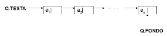
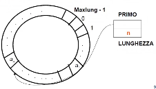

- #[[ASD strutture dati lineari]]
- Def: tipo **astratto** che consente di rappresentare una sequenza di elementi dove è possibile **aggiungere in fondo e prendere in testa**. Accesso **FIFO**
- #+BEGIN_NOTE
  #[[ASD lista vs pila vs coda]]
  #+END_NOTE
- #+BEGIN_TIP
  Utile per rappresentare sequenze in cui elaborare in ordine di arrivo
  #+END_TIP
- ## Specifica sintattica
  collapsed:: true
	- **Tipi**: coda, boolean, tipoelem
	- **Operatori**:
		- **creacoda**: ()                         --> coda
		- **codavuota**: ()                       --> boolean
		- **leggicoda**: (coda)                --> tipoelem
		- **fuoricoda**: (coda)                --> coda
		- **incoda**: (tipoelem, coda)    --> coda
- ## Specifica semantica
  collapsed:: true
	- **Tipi**:
		- **coda**: insieme delle sequenze q = <a_{1}, a_{2}, ..., a_{n}>,  n>=0
		- **boolean**: insieme di valori di verità
	- **Operatori**:
		- **creacoda** = q'
			- POST: q' = <>      *sequenza vuota*
		- **codavuota**(q) = b
			- POST: b = vero     se  q = <>, b = falso altrimenti
		- **leggicoda**(q) = a
			- PRE: q = <a_{1}, a_{2}, ..., a_{n}> e n>=1
			- POST: a = a_{1}
		- **fuoricoda**(q) = q'
			- PRE: q = <a_{1}, a_{2}, ..., a_{n}> e n>=1
			- POST: q' = <a_{2}, a_{3}, ..., a_{n}> se n>1, oppure q'=<> se n=1
		- **incoda**(a, q) = q'
			- PRE: q = <a_{1}, a_{2}, ..., a_{n}> e n>=1
			- POST: q' = <a_{1}, a_{2}, ..., a_{n}, a>
- ## Realizzazioni
	- ### Collegata con puntatori
		- {:height 69, :width 535}
		- vi sono *n* celle, la prima e l'ultima hanno un cursore a testa e fondo
		- **Complessità**: O(1) per ogni operazione
	- **Sequenziale con vettore circolare**
		- {:height 204, :width 361}
		- si usa un array di *maxlung* elementi
		- un indice con valore da 0 a *maxlung -1*, dove si considera l'elemento di indice 0 come successore di quello con indice *maxlung -1*
		- si usano 2 variabili:
			- *primo*: indica il primo elemento
			- *ultimo*: indica l'ultimo elemento inserito
		- #+BEGIN_NOTE
		  se la posizione di *ultimo* ha raggiunto *maxlung* allora il vettore è finito, quindi il prossimo punterà alla testa, ovviamente si perderanno dati ma per evitarlo è necessario prevedere delle logiche
		  #+END_NOTE
		-