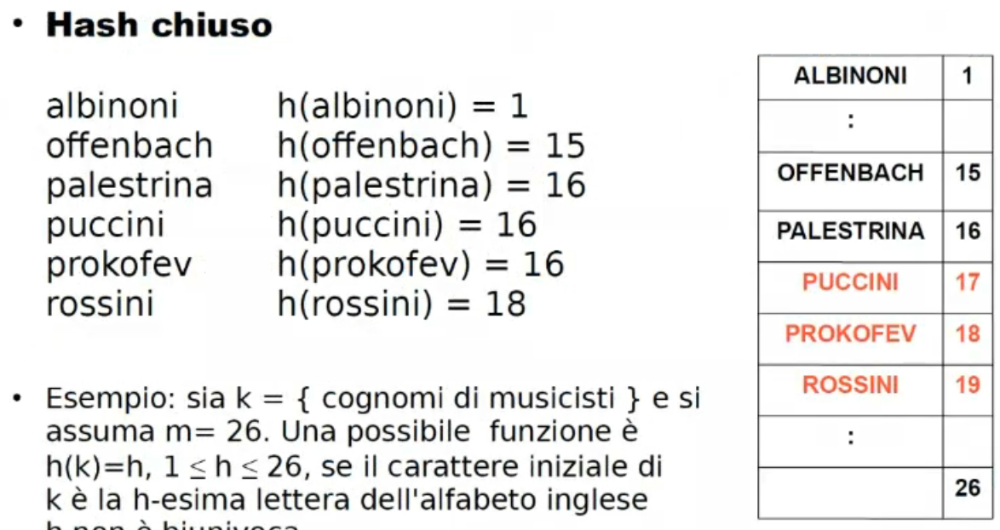
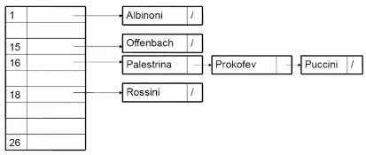
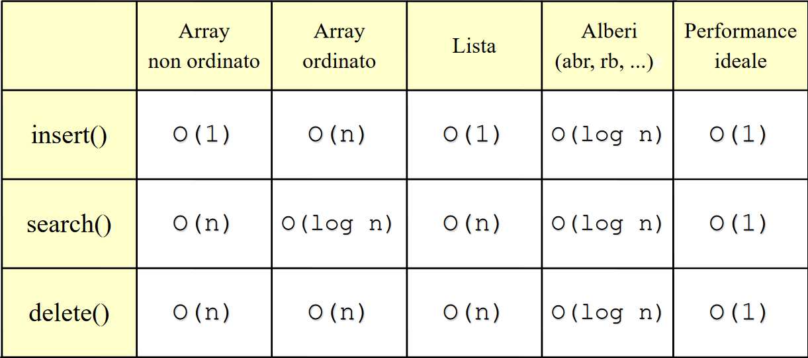

- STRUTTURE che RICHIEDONO USO DEL TIPO #[[ASD insiemi]] ma NON RICHIEDONO TUTTE le OPERAZIONI definite sull'insieme
- #+BEGIN_NOTE
  Il dizionario è un sottotipo di insieme
  #+END_NOTE
- #+BEGIN_TIP
  utile per applicazioni dove non servono gli operatori *unione, intersezione e differenza*
  #+END_TIP
- **BASICS**
  collapsed:: true
	- DIZIONARI = sottotipo del tipo **insieme** #[[ASD insiemi]]
	- si accede per RIFERIMENTO ad un campo CHIAVE = meccanismo di accesso
		- costituita da uno o più attributi
	- gli elementi sono coppie (chiave, valore)
	- in altre parole il dizionario è un insieme di coppie(chiave, valore)
	- #+BEGIN_NOTE
	  Il dizionario si distingue dall'insieme perchè il dizionario ha un campo chiave e uno valore, che permette di associare alle chiavi anche altre informazioni
	  Inoltre nel dizionario è presente l'operatore recupera
	  
	  E' possibile rappresentare un INSIEME con un DIZIONARIO rimuovendo tutte le operazioni insiemistiche
	  Se è necessario un insieme per applicare funzioni che NON sono insiemistiche allora si possono usare le operazioni dei dizionari
	  #+END_NOTE
- **OPERAZIONI**
  collapsed:: true
	- *appartiene* --> verificare l'esistenza di una chiave
	- *inserisci* --> inserimento di nuove coppie (chiave, valore)
	- *cancella* --> cancellazione di coppie
	- *crea* --> crea il dizionario
	- CASI PARTICOLARI:
		- *recupera* --> recupero informazioni nell'attributo
		- *aggiorna* --> modifiche nell'attributo
- **SPECIFICHE SINTATTICHE**
  collapsed:: true
	- Tipi
		- dizionario, boolean, chiave, valore (anche altre strutture)
	- Operatori
		- crea dizionario    () -> dizionario
		- dizionariovuoto   (dizionario) -> boolean
		- appartiene    (chiave, dizionario) -> boolean
		- inserisci   (<chiave, valore>, dizionario) -> dizionario
			- nota *<chiave, valore>* indica una coppia
		- cancella   (chiave, dizionario) -> dizionario
		- recupera   (chiave, dizionario) -> valore
- **SPECIFICHE SEMANTICHE**
  collapsed:: true
	- #+BEGIN_NOTE
	  le {} indicano insiemi
	  #+END_NOTE
	- **Tipi**
		- Dizionario = famiglia di dizionari costituita da coppie di tipo <chiave, valore>
		- boolean = insieme dei valori di verità
	- **Operatori**
		- **creadizionario** = D
			- POST: D = {}
		- **dizionariovuoto**(D) = b
			- POST: b = vero se D = {}, b = falso altrimenti
		- **appartiene**(k, D) = b
			- POST: b = vero se esiste una coppia *<k',v> appartiene D t.c. K' = k,   b = falso altrimenti*
			- #+BEGIN_NOTE
			  si parla di **coppia <k',v>** perché il dizionario è un insieme di coppie(chiave, valore)
			  #+END_NOTE
		- **inserisci** (<k,v>, D) = D'
			- POST: D' = D *unito* {<k,v>} se non esiste una coppia <k',v'> *appartiene* D t.c. k' = k;
			  
			  #+BEGIN_NOTE
			  **caso di aggiunta di una nuova coppia {<k,v>}**: in altre parole non è possibile inserire un insieme nel dizionario se l'elemento chiave dell'insieme da aggiungere è uguale ad un elemento chiave già esistente nel dizionario
			  #+END_NOTE 
			  D' = D \ {<k',v>} *unione* {<k,v>} se esiste già una coppia <k',v'> *appartiene* D t.c. k' = k;
			- #+BEGIN_NOTE
			  **caso dove esiste già la chiave e bisogna solo cambiare il valore** l'operatore *inserisci* aggiunge un INSIEME {<k,v>} formato da una COPPIA di due ELEMENTI
			  #+END_NOTE
		- **cancella**(k,D) = D'
			- PRE: esiste una coppia <k',v'> *appartiene* D t.c. k'=k
			- POST: D' = D \ {<k',v'>}
		- **recupera**(k,D) = V
			- PRE: esiste una coppia <k',v'> *appartenente* D t.c. k'=k
			- POST: v = v'
			- #+BEGIN_NOTE
			  nella PRE si passa una coppia da cercare, se la chiave cercata è uguale ad una del dizionario, allora nella POST restituisco il valore associato a quella chiave
			  #+END_NOTE
- **RAPPRESENTAZIONI**
	- identiche a quelle per l'insieme (rappresentazione con vettore booleano(vettore caratteristico) e rappresentazione con lista (i cui elementi sono quelli dell'insieme))
	- #+BEGIN_NOTE
	  poco efficienti
	  #+END_NOTE
	- ### **VETTORE ORDINATO**
	  collapsed:: true
		- #+BEGIN_TIP
		  conviene quando ci sono molte letture e poche scritture
		  #+END_TIP
		- **RAPPRESENTAZIONE**
		  collapsed:: true
			- si usa un vettore con un **cursore** (solo una semplice variabile) all'ultima posizione occupata
			- si stabilisce una **relazione di ordinamento totale** <= sulle **chiavi**
			- le chiavi sono memorizzate su un vettore in posizioni contigue e in ordine crescente partendo dalla prima posizione
		- **VERIFICA DELL'APPARTENENZA**
		  collapsed:: true
			- **ricerca binaria (dicotomica)**
				- Definizione dei tipi:
					- Dizionario: tipo strutturato con:
						- elementi: array di maxlung elementi di tipo tipoelem
						- ultimo: intero in [0...maxlung]
				- > 1. confronta la chiave *k* da cercare con l'elemento che occupa la posizione centrale del vettore
				  2. stabilisci in quale metà proseguire la ricerca (ricorda che il vettore è ordinato)
				- #+BEGIN_NOTE
				  complessità del caso pessimo: logaritmica --> log_{2}(n)
				  #+END_NOTE
		- **COMPLESSITA' COMPUTAZIONALE DELLE OPERAZIONI**
		  collapsed:: true
			- **inserisci**: *log_{2}(n) + O(n) = O(n)* comporta uno spostamento in avanti di ogni elemento
				- nota: la complessità logaritmica è data dalla ricerca (binaria), questo perchè prima di inserire si deve cercare il posto dove mettere il valore
			- **appartiene**: *log_{2}(n)* se ricerca binaria
			- **recupera**: chiama appartiene e quindi prende la sua complessità
	- ### **TABELLA HASH**
		- si appoggia su una struttura dati tabellare
		- idea base: ricavare la **posizione** che la chiave occupa in un vettore **dalla chiave stessa**
		- #+BEGIN_PINNED
		  le operazioni di **ricerca** e di **modifica** hanno **tempo costante** e sono indipendenti sia dalla dimensione del dizionario che dall'insieme dei valori che verranno gestiti
		  #+END_PINNED
		- #+BEGIN_IMPORTANT
		  Vettore caratteristico
		  solo l'elemento io si può trovare in posizione i-esima, se mai aggiunto avrà FALSE sarà sempre così e ci sarà spreco
		  I PROBLEMI SONO: reperire sempre la stessa posizione alla possibile variazione dei dati collegati ad esso; inoltre è necessario che entità diverse abbiano sempre posizioni diverse senza collidere
		  #+END_IMPORTANT
		- **RAPPRESENTAZIONE**
			- esistono diverse varianti che si possono far risalire ad una forma:
			  collapsed:: true
				- **dinamica/estensibile**:
				  collapsed:: true
					- modifica dinamicamente le dimensioni della tabella hash in base al numero di elementi che si inseriscono o eliminano
				- **statica** (si usano strutture di tabelle di dimensione prefissata costituita da una struttura allocata sequenzialmente in memoria in forma di un array):
				  collapsed:: true
					- **hash chiuso**: consenti di inserire un insieme limitato di valori in uno spazio di dimensione fissa
					  collapsed:: true
						- struttura composta da una quantità massima (maxbucket) di contenitori di uguale dimensione (**bucket**)
						- ogni **bucket** può mantenere all'interno al massimo un numero *nb* di coppie
							- ES: *nb*=1; ogni bucket avrà una sola coppia (chiave,valore)
					- **hash aperto**: consente di memorizzare un insieme di valori di dimensione qualsiasi in uno spazio potenzialmente illimitato
					  collapsed:: true
						- la struttura è composta da un certo numero di contenitori bucket, contenenti un numero indeterminato di elementi
					- #+BEGIN_NOTE
					  In entrambi i casi di hash chiuso e aperto si usa una funzione aritmetica per calcolare la posizione in tabella partendo dalla chiave
					  #+END_NOTE
					- #+BEGIN_TIP
					  sono alternative efficaci all'indirizzamento diretto del vettore, perché la dimensione è **uguale a quella degli elementi effettivamente presenti nel dizionario**
					  #+END_TIP
			- ## Tabelle hash
				- *K* = **insieme** di tutte le possibili chiavi distinte
				- *v* = **vettore**
				- *m* = **dimensione** del vettore dove si memorizza il dizionario
				- la soluzione ideale è la funzione di accesso che data una chiave K **fornisce la posizione (*h*) nel vettore (*v*)** tra 0 ed *m* per trovare il bucket da cui leggere:
				  >h: K -> {1, ..., m}
				- così che se *k_{1} appartiene K* e *k_{2} appartiene K*,    *k_{1} diverso k_{2}*   si ha che  *h(k_{1}) diverso h(k_{2})*
				- #+BEGIN_NOTE
				  In altre parole: se k_{1} appartiene all'insieme delle chiavi K e k_{2} appartiene a K, dove k_{1}e k_{2} sono diverse, si ha che la posizione (h) di k_{1} deve essere diversa dalla posizione h di k_{2}
				  #+END_NOTE
				- utilizzando *m = | K |* si ha garanzia di biunivocità (un elemento punta ad uno e uno solo) e di poter accedere direttamente alla posizione contenente la chiave
				- se *| K |* è grande si ha spreco di memoria elevato
					- la dimensione *m* del vettore va scelta in base al **numero di chiavi attese**
				- la soluzione di compromesso è scegliere *m* maggiore di 1 ma **molto meno di |K|**
				- ## ESEMPIO Hash Chiuso
				  collapsed:: true
					- 
					- Si prende un vettore, si crea un dizionario di 26 posti, ogni posizione è una lettera dell'alfabeto in ordine alfabetico
					- la funzione di hash restituisce la posizione nel vettore a seconda della prima lettera del cognome
					- si nota che se la lettera inziale è identica per più musicisti si ha una collisione
						- si decide di spostarsi progressivamente verso una posizione libera
							- al cambio della lettera si dovrebbe ottenere la posizione nell'alfabeto, ma si viene spostati più avanti nel vettore
				- ## HASH APERTO
					- consente di evitare la formazione di agglomerati e risolve il problema delle cancellazioni
					- si mantiene la lista delgli elementi le cui chiavi producono lo stesso valore della funzione
					- la **tabella hash** viene realizzata definendo un **array di liste di bucket** (liste di trabocco)
						- la funzione hash viene utilizzata per determinare quale lista potrebbe contenere l'elemento che possiede una determinata chiave in modo da poter attivare una successiva operazione di ricerca nella lista corrispondente e da restituire la posizione del bucket che contiene la chiave
						- 
						- si calcola la posizione dove salvare con la funzione hash e nel vettore si ha una lista per ogni posizione
						- la lista contiene tutte LE CHIAVI mappate a quella posizione
						- la **cancellazione** è locale alla lista, non servono scansioni, si calcola sempre la funzione senza dover trovare la posizione
							- se la funzionnen hash distribuisce male si riconduce ad una scansione lineare nella lista
						- **OTTIMO**: avere vettore adeguato al numero di chiavi attese
							- funzione hash che distribuisce bene
								- liste corte, quindi poche operazione di scansione
							- **COMPLESSITA' COSTANTE** nella maggioranza dei casi
- **COLLISIONI**
	- originate da una funzione che produce lo stesso risultato
	- background-color:: green
	  #+BEGIN_NOTE
	  Non è possibile annullare completamente le collisioni, ma si deve ridurle il più possibile. Per evitarle sarebbe necessario un vettore di dimensione pari a tutti i possibili casi, quindi di grandezza infinita (impossibile ovviamente)
	  #+END_NOTE
	- Metodi di risoluzione delle collisioni
		- **SCANSIONE LINEARE**
		  collapsed:: true
			- se *h(k)* per qualunque *k* indica una posizione occupata, si ispeziona la posizione successiva nel vettore; se anche questa è occupata si prosegue fino a che la tabella non è satura
			- #+BEGIN_TIP
			  Per rendere questo processo più efficiente è necessario capire se una data locazione è sempre stata libera o se è stato cancellato un elemento da essa. Per farlo si usano chiavi fittizie *libero* e *cancellato*
			  #+END_TIP
			- #+BEGIN_WARNING
			  questa strategia può produrre nel tempo la produzione di **agglomerati** infatti se si producono molte **cancellazioni** per trovare la posizione del prossimo valore da rimuovere si potrebbe finire con lo scandire tutte le posizioni del vettore
			  #+END_WARNING
	- qualsiasi sia la funzione hash adottata deve fronteggiare gli **agglomerati** e le **collisioni**:
	  collapsed:: true
		- occorre una **funzione hash**: calcolabile velocemente e che **distribuisca le chiavi uniformemente** in *v*, in modo da ridurre le collisioni
		- occorre un **metodo di scansione**: per risolvere le collisioni, utili a reperire le chiavi che hanno trovato la posizione occupata e che non provochi la formazione di agglomerati di chiavi oltre che a ridurli
		- avere agglomerati comporta che si produrranno agglomerati sempre più grandi e quando si dovranno effettuare operazioni si sarà rallentati
		- la dimensione *m* del vettore *v* deve essere una sovrastima del numero delle chiavi attese, per evitare di riempire *v* completamente (serve a risolvere le collisioni)
	- **DEFINIRE FUNZIONI HASH (ricorda che la funzione definisce una POSIZIONE)**
		- è conveniente considerare la rappresentazione binaria *bin(k)* della chiave *k*, poi si verifica a che numero intero corrisponde
		  collapsed:: true
			- **PROBLEMA**: l'intero potrebbe essere troppo grande e non compatibile con la dimensione del vettore
				- **SOLUZIONE**: si prende una sottostringa e si converte solo quella in intero, così da ottenere un numero valido all'interno del vettore
		- **MIGLIORE SOLUZIONE:** prendere un oggetto --> si fa la rappresentazione binaria --> si converte in intero --> si esegue il modulo tra l'intero e la dimensione del vettore --> si ottiene una posizione nell'intervallo *[0, m-1]*
		  collapsed:: true
			- tende a distribuire **probabilisticamente** in maniera più uniforme
			- può rappresentare qualsiasi cosa usando interi
- **METODI DI SCANSIONE**
	- si usano quando si incontra una locazione occupata e bisogna trovarne un'altra libera
	- funzione *f_{1}* usata per l'*i-esima* volta che si trova una posizione del vettore *v* occupata;
		- > *i>=0, (per i=0, f_{0}=h)*
	- la funzione dovrebbe toccare le posizioni di *v* solo una volta
	- **SCANSIONE LINEARE**
	  collapsed:: true
		- > *f_{i} = (h(k) + h * i)  mod m*
		- *h* è un intero positivo primo con *m*
		- *h* è la distanza tra due posizioni successive esaminate nella scansione, se *h=1* la scansione ha passo unitario
		- essendo *h* e *m* primi tra loro, si esaminano tutte le posizioni di *v* prima di riconsiderare le posizioni già esaminate
		- #+BEGIN_NOTE
		  SVANTAGGIO: non si riduce la formazione di agglomerati
		  #+END_NOTE
	- **SCANSIONE QUADRATICA**
		- > *f_{i} = (h(k) + h * i^{2})  mod m*
		- *m* è primo
		- *h* (la distanza tra due posizioni successive da esaminare) è variabile, quindi si riduce la possibilità di agglomerati
		- #+BEGIN_NOTE
		  SVANTAGGIO: la sequenza di scansione non include tutte le posizioni di *v* (svant. trascurabile per *m* non troppo piccolo)
		  #+END_NOTE
	- **SCANSIONE PSEUDOCASUALE (migliore delle altre)**
		- > f_{i} = (h(k) + r_{i})  mod m
		- *r_{i}* è l'*i-esimo* numero generato da un generatore di numeri pseudocasuali, che genera gli interi tra 1 e *m* una sola volta in qualunque ordine
		- viene generata una sola volta una sequenza, ogni volta che si chiede la sequenza viene sempre restituita la stessa, questo per consentire di accedere alle posizioni
	- **HASHING DOPPIO**
		- > *f_{i} = (h(k) + i * h'(k)  mod m*
		- *h'* è un'altra funzione di hash diversa da *h*
	- **SCANSIONE INTERNA (generalmente consigliate)**
		- cercano posiazione dove scrivere all'interno dello stesso vettore di ricerca, deriva che per quanto possano essere buone le funz di scansione si avranno sempre collisioni, se i sono molte cancellazioni si può sfociare in complessità lineare
- **COSTI**
	- 