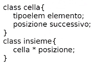

- DEF: è una collezione di elementi di tipo omogeneo i quali possono ricorrere solo una volta. Inoltre gli elementi non posseggono una posizione
- ## Tipi di definizioni
	- **estensionale** (si usa questo generalmente)
	  collapsed:: true
		- si definiscono i singoli elementi senza tenere conto della posizione
		- A = {x, z, y}
	- **intensionale**
	  id:: 63b85bac-a379-4e0b-a342-350797c6e968
	  collapsed:: true
		- si definiscono le proprietà che devono avere i componenti, sistema usato per definire anche insiemi infiniti
		- B = {elementi nel collegio ba19 nel 1994}
		- C = {numeri reali compresi tra 0 e 1}
- ## Operazioni
	- **cardinalità**: il numero di elementi di un insieme, ne rappresenta anche la dimensione
	  collapsed:: true
		- |A| = 3
		- |B| è finito
		- |C| è infinito
	- **unione**: A ∪ B
	- **intersezione**: A ∩ B
	  id:: 63a72e71-7597-4ee8-a588-a93a8e91d2df
	- **differenza**: A \ B
	- la relazione fondamentale è quella di **appartenenza** x ∈ A, ne deriva l'**inclusione** B ⊆ A
	  collapsed:: true
		- **appartenenza** significa verificare che un elemento esista in un insieme
		- **inclusione** significa verificare che tutti gli elementi (l'insieme) è contenuto in un altro
- ## Specifiche sintattiche
	- **Tipi**: insieme, boolean, tipoelem
	- **Operatori**:
		- **creainsieme**: ()                                      --> insieme
		- **insiemevuoto**: ()                                    --> boolean
		- **appartiene**: (tipoelem, insieme)           --> boolean
		- **inserisci**: (tipoelem, insieme)                --> insieme
		- **cancella**: (tipoelem, insieme)                --> insieme
		- **unione**: (insieme, insieme)                    --> insieme
		- **intersezione**: (insieme, insieme)           --> insieme
		- **differenza**: (insieme, insieme)               --> insieme
- ## Specifiche semantiche
	- **Tipi**:
	  collapsed:: true
		- **insieme**: famiglia di insiemi costituita da elementi di tipo *tipoelem*
		- **boolean**: insieme valori verità
	- **Operatori**:
	  collapsed:: true
		- **creainsieme** = A
			- POST: A = {}
		- **insiemevuoto(A)** = b
			- POST: b = vero se a = {}, b = falso altrimenti
		- **appartiene (x,A)** = b
			- POST: b = vero se x ∈ A, b = falso altrimenti
		- **inserisci (x,A)** = A'
			- PRE: x ∉ A (oppure senza precondizione)
			- POST: A' = A ∪ {x}     {se x ∈ A: A' = A}
				- #+BEGIN_WARNING
				  attenzione alla simbologia
				  NON è possibile unire un elemento ad un insieme
				  ma è possibile unire 2 insiemi di cui uno contiene anche un solo elemento, infatti si usa questa proprietà per inserire anche un solo elemento
				  #+END_WARNING
		- **cancella (x, A)** = A'
			- PRE: x ∈ A     (oppure senza precondizione)
			  id:: 63a74107-f0c5-49e2-b4ba-b9cd9a07e173
			- POST: A' = A \ {x}      (se x ∉ A: A' = A)
				- #+BEGIN_WARNING
				  attenzione alla simbologia
				  NON è possibile rimuovere un elemento da un insieme
				  ma è possibile rimuovere 2 insiemi di cui uno contiene anche un solo elemento, infatti si usa questa proprietà per rimuovere anche un solo elemento
				  #+END_WARNING
		- **unione(A, B)** = C
			- POST: C = A U B
		- **intersezione(A, B)** = C
			- POST: C = A ∩ B
		- **differenza (A, B)** = C
			- POST: C = A \ B
- ## Realizzazioni
	- **Vettore booleano (vettore caratteristico)** (per linguaggi che non hanno il tipo insieme)
	  collapsed:: true
		- si rappresenta un insieme *A*, i cui elementi sono INTERI [1, n].  Attraverso un vettore pari ad *n* si imposta la singola cella a TRUE o FALSE a seconda della presenza o meno dell'intero nel vettore
		- formalmente: k=true se k∈A altrimenti k=false
	- **Lista non ordinata** #[[ASD liste]]
	  collapsed:: true
		- 
		- si possono rappresentare tutti i tipi
		- nella lista ci sono tutti i valori dell'insieme
		- #+BEGIN_NOTE
		  In caso di realizzazioni dinamiche l'occupazione in memoria è proporzionale al numero di elementi dell'insieme
		  #+END_NOTE
		- si controlla l'appartenenza dell'elemento da inserire nell'insieme e si procede all'inserimento in testa alla lista
			- #+BEGIN_NOTE
			  si dovrà verificare l'appartenenza perchè la lista prevede duplicati, gli insiemi NO. La verifica di appartenenza costa O(n)
			  #+END_NOTE
		- **Costi**
			- creainsieme: O(1)
			- insiemevuoto: O(1)
			- appartiene: O(n)
			- inserisci: O(1). Considerando l'operazione di appartenenza è asintoticamente O(n)
				- NOTA: seppure l'inserimento avvenga in testa bisogna verificare che non esista il suo duplicato
			- cancella: O(1). Considerando l'operazione di appartenenza è asintoticamente O(n)
			- unione: O(n)^{2}
			- intersezione: O(n)^{2}
			- differenza: O(n)^{2}
	- **Liste ordinate**
	  collapsed:: true
		- Se è definita una relazione "<=" di ordinamento totale sugli elementi dell'insieme, è possibile rappresentarlo con una lista ordinata per valori crescenti due puntatori che scorrono ognuno su un insieme
		- PRO:
			- *appartiene*: ricerca in una lista ordinata
			- *inserimento*: richiede di scandire tutta la lista nel peggiore delle ipotesi
			- *cancellazione*: ricerca in una lista ordinata
			- *unione, intersezione, differenza*: facilitate dal poter scorrere su due liste ordinate