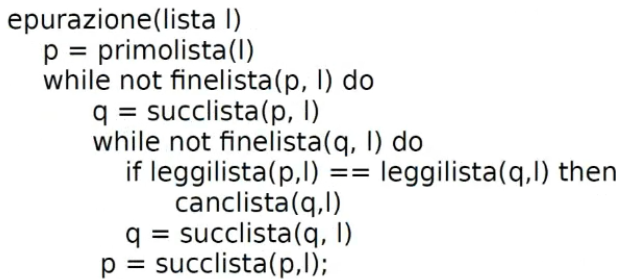
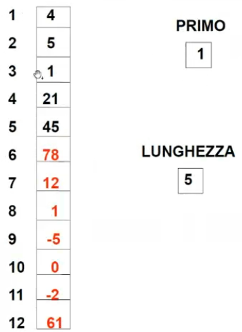
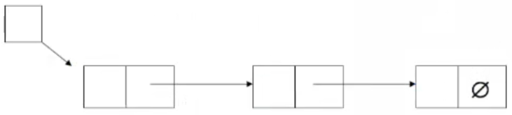
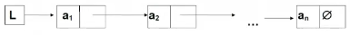
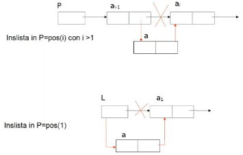
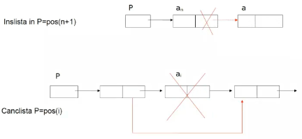
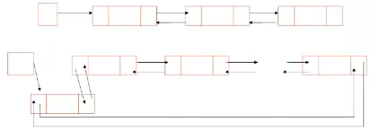
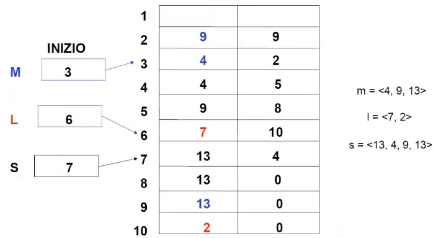

- #[[ASD strutture dati lineari]]
- **Definizione**: sequenza dinamica e finita, anche vuota, omogenea (elementi dello stesso tipo)
- #+BEGIN_NOTE
  differisce dall'insieme #[[ASD insiemi]] (ricorda insieme come def matematica). Infatti la lista può contenere più volte lo stesso elemento
  
  
  #[[ASD lista vs pila vs coda]]
  #+END_NOTE
- #+BEGIN_TIP
  E' consigliabile la lista **quando sono necessari duplicati**, ma attenzione perchè è necessaria la relazione d'ordine
  #+END_TIP
- ## Notazione
	- l = <a_{1}, a_{2}, ..., a_{n}>    n>=0
	- a ciascun elemento si associa una posizione *pos(i)*
	- e un valore *a(i)*
- ## Accesso
	- accesso diretto solo al primo elemento della sequenza
	- accesso per scansione sequenziale per tutti gli elementi intermedi
- ## Lunghezza
  collapsed:: true
	- la **lunghezza di una lista** è il numero dei suoi elementi, se non contiene elementi allora la lunghezza è 0 e si dice *"lista vuota"*
		- #+BEGIN_WARNING
		  La **lunghezza conta le posizioni**, non i simboli distinti
		  #+END_WARNING
- ## Sottolista
  collapsed:: true
	- data una lista l = <a_{1}, a_{2}, ..., a_{n}>, per ogni *i* e *j*, tali che *1<=i<=j<=n*, una sottolista di *l* è definita partendo dalla posizione *i* fino alla posizione *j* includendo tutti i valori intermedi
	- la lista vuota < > è sottolista di qualsiasi lista
- ## Specifica sintattica (tipi)
	- **Tipi**:
		- lista,
		- posizione,
		- boolean,
		- tipoelem
	- **Operatori**:
		- crealista: ()                                                  --> lista
		- listavuota: (lista)                                         --> boolean
		- leggilista: (posizione, lista)                        --> tipoelem
		- scrivilista: (tipoelem, posizione, lista)       --> lista
		- primolista: (lista)                                         --> posizione
		- finelista: (posizione, lista)                          --> boolean
		- succlista: (posizione, lista)                        --> posizione
		- predlista: (posizione, lista)                        --> posizione
		- inslista: (tipoelem, posizione, lista)           --> lista
		- canclista: (posizione, lista)                        --> lista
- ## Specifica semantica (variabili)
	- **Tipi**:
	  collapsed:: true
		- lista: insieme delle sequenze (l = <a1, a2, ..., a_{n}>    n>=0) di elementi di tipoelem. Ogni elemento ha posizione *pos(i)* e valore *a(i)*
		- boolean: valori di verità
	- **Operatori**:
		- **crealista = l'**
		  collapsed:: true
			- POST: l' = <> (sequenza vuota)
		- **listavuota(l) = b**
		  collapsed:: true
			- POST:
			  collapsed:: true
				- b = *true* se l = <>
				- b = *false* altrimenti
			- #+BEGIN_NOTE
			  è ridondante infatti può essere ottenuto lo stesso risultato con **finelista**
			  #+END_NOTE
		- **leggilista(p, l) = a**
		  collapsed:: true
			- PRE: p = pos(i) 1<=i<=n
			- POST: a = a(i)
		- **scrivilista(a, p, l) = l'**
		  collapsed:: true
			- PRE: p = pos(i) 1 <= i <= n
			- POST: l' = <a1, a2, ..., a_{n-1}, **a**, a_{i+1}, ..., a_{n}>
			- #+BEGIN_WARNING
			  scrivilista è diverso da insilista perchè, il primo SOVRASCRIVE un elemento, mentre il secondo ne aggiunge uno
			  #+END_WARNING
		- **primolista(l) = p**
		  collapsed:: true
			- POST: p = pos(l)
		- **finelista(p, l) = b**
		  collapsed:: true
			- PRE: p = pos(l) 1 <= i <= n+1
			- POST:
				- b = *true* se p = pos(n+1)
				- b = *false* altrimenti
			- #+BEGIN_NOTE
			  si usa n+1 per indicare la fine della lista e non dell'ultimo elemento **perchè ?????**
			  #+END_NOTE
		- **succlista(p, l) = q**
		  collapsed:: true
			- PRE: p = pos(i) 1 <= i <= n
			- POST: q = pos(i+1)
		- **predlista(p, l) = q**
		  collapsed:: true
			- PRE:  p = pos(i)    2 <= i <= n
			- POST: q = pos(i-1)
		- **inslista(a, p, l) = l'**
			- PRE: p = pos(i)     1 <= i <= n+1
			- POST:
			  collapsed:: true
				- l' = <a1, a2, ..., a_{n-1}, **a, a_{i}**, a_{i+1}, ..., a_{n}> se 1 <= i <= n
				  collapsed:: true
					- #+BEGIN_NOTE
					  consente l'inserimento all'interno della sequenza
					  #+END_NOTE
				- l' = <a1, a2, ..., **a_{n}, a**> se i = n+1 e quindi l' = < a > se i = 1 e l = < >
				  collapsed:: true
					- #+BEGIN_NOTE
					  consente l'inserimento in coda alla sequenza
					  #+END_NOTE
			- #+BEGIN_WARNING
			  scrivilista è diverso da insilista perchè, il primo SOVRASCRIVE un elemento, mentre il secondo ne aggiunge uno
			  #+END_WARNING
		- **canclista(p, l) = l'**
		  collapsed:: true
			- PRE: p = pos(i)     1 <= i <= n
			- POST: l' = <a1, a2, ..., a_{n-1}, a_{i+1}, ..., a_{n}>
	- **Riassumendo**
	  collapsed:: true
		- per accedere ad un elemento serve conoscere la sua posizione
			- l'unico che si conosce direttamente è il primo
			- per gli altri elementi serve succlista o predlista
		- l'operatore **listavuota** è ridondante perchè è equivalente a **finelista**
- ## Eliminazione di duplicati
  collapsed:: true
	- data una lista *l* di interi eliminare i duplicati contenuti in essa, usare solo gli operatori definiti prima
	- 
- ## Rappresentazione sequenziale
  collapsed:: true
	- lista rappresentata mediante #[[ASD array]] monodimensionale (vettore)
	- si usa:
	  collapsed:: true
		- una variabile **primo** per indicare il primo elemento della lista mediante la sua posizione nell'array
		- una variabile **lunghezza** per indicare il numero di elementi di cui la **lista** si compone
	- 
	- **PRO**:
	  collapsed:: true
		- facile da realizzare
	- **CONTRO**:
	  collapsed:: true
		- bisogna considerare di non creare un vettore troppo grande rispetto al numero di elementi
		- inserimento e cancellazione di elementi, sarà necessario traslare gli elementi **costo O(n)**
		- in caso di occupazione totale o quasi totale si deve fare **doubling**, invece se diventa quasi vuoto si deve fare **dimezzamento**
		  collapsed:: true
			- costo in tempo e spazio spesso svantaggioso
	- **Complessità operatori**
	  collapsed:: true
		- crealista = costante O(1)
		- listavuota = costante O(1)
		- leggilista = costante O(1)
		- finelista = costante O(1)
		- primolista = costante O(1)
		- succlista = costante O(1)
		- predlista = costante O(1)
		- scrivilista = costante (da solo)
		- inslista = O(n)
		  collapsed:: true
			- si deve traslare
		- canclista = O(n)
		  collapsed:: true
			- si deve traslare
	- **COMPLESSITA' OPERAZIONI**
	  collapsed:: true
		- inserimento: O(n)
		- cancellazione: O(n)
		- lettura: O(n)
		- aggiornamento: O(n)
	- #+BEGIN_TIP
	  Se si è coscienti che si devono fare frequenti cancellazioni o inserimenti nel mezzo della lista allora questa implementazione è SVANTAGGIOSA. Invece se bisogna inserire o cancellare agli estremi allora è vantaggiosa visto che la complessità è costante
	  #+END_TIP
- ## Rappresentazione collegata
	- l'idea fondamentale è di rappresentare gli elementi insieme ad un'informazioni (**riferimenti**) che indici dove si trova il successivo
	- #+BEGIN_NOTE
	  **La rappresentazione collegata può non basarsi su puntatori**. La lista non implica che in memoria si abbiano locazioni contigue
	  #+END_NOTE
	- **Notazione grafica**
	  collapsed:: true
		- nodi = elementi
		- archi = riferimenti
	- **Rappresentazione con puntatori**:
		- {:height 139, :width 581}
		- Ingredienti:
			- puntatore al primo elemento
			- simbolo speciale di terminazione
				- in caso di lista vuota compare nel puntatore all'elemento iniziale
		- #+BEGIN_NOTE
		  la schematizzazione grafica è la medesima a quella della rappresentazione con cursori
		  #+END_NOTE
		- la differenza rispetto a quella con cursori è che NON si usano i vettori ma si usano celle di memoria allocate quando è necessario memorizzare nuovi elementi
		- **OPERAZIONI** su variabili *P* di tipo puntatore:
		  collapsed:: true
			- **accesso** alla locazione il cui indirizzo è memorizzato in *p*
			- **new** = la richiesta di una nuova locazione di memoria e dell'indirizzo in *p*
			- **delete** = rilascio della locazione di memoria il cui indirizzo è memorizzato in *p*
		- 
			- Aggiornamento dei puntatori
				- 
				- 
				- nel momento della cancellazione il sistema operativo sa già che quella locazione è disponibile e non serve usare una *listalibera*
			- **Realizzazione con doppi puntatori o simmetrica** (rende costanti tutte le operazioni)
				- 
				- è presente un overhead per la gestione dei doppi puntatori, comunque è trascurabile
				- **PRO**:
					- si scandisce in entrambe le direzioni
					- si individua facilmente l'elemento che precede
					- si possono realizzare le operazioni di inserimento senza dover usare variabili aggiuntive
				- #+BEGIN_TIP
				  essendo **una delle migliori realizzazioni per rappresentazioni collegate** si potrebbe sempre usare questa rappresentazione ma molto spesso nella realizzazione su campo di produzione si usano spesso le liste per accedere direttamente  degli elementi perché molte librerie non sono aderenti perfettamente a questa realizzazione. Sono implementati metodi che consentono l'accesso diretto all'i-esimo elemento
				  #+END_TIP
	- **Rappresentazione con cursori**:
		- 
		- Ingredienti:
		  collapsed:: true
			- #[[ASD array]] che attraverso i riferimenti supera i problemi
			- si realizzano i riferimenti mediante cursori
				- #+BEGIN_NOTE
				  CURSORI: sono variabili intere o enumerative, il cui valore è interpretato come indice di un vettore
				  #+END_NOTE
			- si definisce un vettore spazio:
				- può contenere più liste, ognuna individuata da un proprio cursore iniziale
				- contiene tutte le celle libere, organizzate in una lista *"listalibera"*
		- **COSTI**
		  collapsed:: true
			- crealista: O(1)
			- listavuota: O(1)
			- leggilista: O(n)
			- scrivilista: O(n)
			- primolista: O(1)
			- finelista: O(n)
			- succlista: O(1)
			- predlista: O(n)
			  collapsed:: true
				- da notare che nella struttura creata si ha solo il riferimento al successivo, per ricavare il precedente si deve scandire nuovamente oppure salvare con una colonna in più il precedente. 
				  In entrambi i casi la complessità non varia, al più varia in spazio ma non in tempo
			- inslista: O(n)
			- canclista: O(n)
		- **CONTRO**:
		  collapsed:: true
			- la struttura è comunque rigida, se si supera la capacità bisogna fare doubling
			- si occupa memoria per indici del successivo (e del precedente)
			  collapsed:: true
				- nonostante ciò se si implementasse questa struttura su classi con più attributi, l'overhead degli indici è meno percepibile