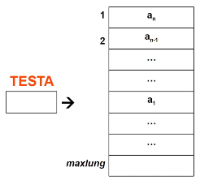
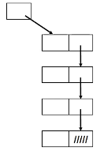
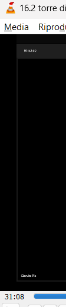

- #[[ASD strutture dati lineari]]
- **Definizione**: sequenza finita, anche vuota, omogenea (elementi dello stesso tipo), caratterizzata da accesso LIFO dove è possibile aggiungere o togliere elementi solo ad un estremo
- Deve essere posta una relazione d'ordine
- #+BEGIN_NOTE
  è possibile vederlo come caso particolare di lista dove si lavora in maniera LIFO
  
  
  #[[ASD lista vs pila vs coda]]
  #+END_NOTE
- #+BEGIN_TIP
  Le pile sono usate all'interno della gestione delle chiamate ricorsive
  #+END_TIP
- ## Specifica sintattica
  collapsed:: true
	- **Tipi:** pila, boolean, tipoelem
	- **Operatori**:
		- **creapila**: () --> pila
		- **pilavuota**: (pila) --> boolean
		- **leggipila**: (pila) --> tipoelem
		- **fuoripila**:(pila) --> pila
		- **inpila**: (tipoelem, pila) --> pila
- ## Specifica semantica
  collapsed:: true
	- **Tipi**:
		- pila = insieme delle sequenze P=<a_{1}, a_{2}, ..., a_{n}>, n>=0, di elementi di tipo tipoelem gestita con accesso LIFO
		- boolean = insieme dei valori di verità
	- **Operatori**:
		- **creapila** = p
			- POST: p=<>
		- **pilavuota**(p) = b *empty*
			- POST: b=vero se p=<>, altrimenti b=falso
		- **leggipila(p)** = a
			- PRE: p=<a_{1}, a_{2}, ..., a_{n}>, n>=1
			- POST: a=a_{i}
		- **fuoripila(p)**=p'     *pop*
			- PRE: p=<a_{1}, a_{2}, ..., a_{n}>, n>=1
			- POST: p'=<a_{1}, a_{2}, ..., a_{n}> se n>=1  p'=<> se n=1
		- **inpila(a, p)** = p'     *push*
			- PRE: p=<a_{1}, a_{2}, ..., a_{n}>, n>=0
			- POST: p'=<a_{1}, a_{2}, ..., a_{n}>
- ## Realizzazioni
	- essendo la pila un caso particolare di lista, ogni funzione della lista funziona anche sulla pila
	  collapsed:: true
		- creapila() --> crealista()
		- pilavuota(p) --> listavuota(p)
		- leggipila(p) --> leggilista(primolista(p), p)
		- fuoripila(p) --> cancista(primolista(p), p)
		- inpila(a, p) --> insilista(a, primolista(p), p)
	- ## Realizzazione con vettore
		- Si usano:
			- cursore al primo elemento (testa)
			- vettore
		- 
		- si memorizzano gli *n* elementi della pila, in ordine inverso, nelle prime *n* posizioni del vettore, mantenendo un cursore alla testa della pila
		- CONTRO: tutti quelli del vettore
		- PRO:
			- facile da realizzare
			- a differenza della pila, gli inserimenti e cancellazioni non richiedono spostamenti visto che si opera sempre all'estremità dell'array
		- **Costi**: ogni operatore richiede tempo costante
	- ## Realizzazione collegata, con puntatori
		- Si usa un puntatore alla cella che si trova in cima
		- 
		-
- ## Pile e procedure ricorsive
	- è possibile trasformare un programma ricorsivo in iterativo
	- #+BEGIN_TIP
	  Sconsigliato perché quelli ricorsivi sono più efficienti agli iterativi perché non è necessario salvare lo stato e ripristinarlo
	  #+END_TIP
- 