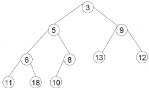
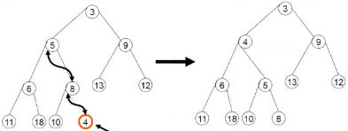

- ## Definizione
  collapsed:: true
	- Caso particolare di #[[ASD insiemi]] (per mancanza di duplicati)
	- Definita una relazione "<=" d'ordinamento totale
	- è possibile inserire un nuovo elemento o estrarre l'elemento minimo
	- in generale la priorità è una caratteristica aggiuntiva associata agli elementi
- ## Operazioni
  collapsed:: true
	- crea
	- insierisci
	- **min**
	- **cancellamin**
- ## Specifica sintattica
  collapsed:: true
	- **Tipi**: prioricoda, tipoelem
	- **Operatori**:
		- creaprioricoda:    () --> prioricoda
		- inserisci:              (tipoelem, prioricoda) --> prioricoda
		- min:                      (prioricoda) --> tipoelem             [trova l'elemento con priorità minore]
		- cancellamin:        (prioricoda) --> prioricoda           [cancella l'elemento con priorità minore]
- ## Specifica semantica
  collapsed:: true
	- **Tipi**:
		- prioricoda: insieme di code con priorità con elementi di tipo tipoelem
	- **Operatori**:
		- **creaprioricoda() = A**
			- POST: A = ∅
		- **inserisci(x,A) = A'**
			- POST: A'=A  {x}   (se x  A allora A=A')
		- **min(A) = x**
			- PRE: A ≠ ∅
			- POST: x∈A e x<y ∀ y∈A,  x≠y
				- NOTA: il "<" indica che ci sarà sempre un ordinamento totale sugli elementi in base alla priorità
		- **cancellamin(A) = A'**
			- PRE: A ≠ ∅
			- POST: A' = A -{x} con x=min(A)
- ## Rappresentazione con strutture sequenziali
  collapsed:: true
	- è possibile rappresentarla con #[[ASD liste]] ordinate e non ordinate
	- la coda con priorità è costituita da un insieme di atomi linearmente ordinati, ma **senza relazione strutturale** sull'insieme delle posizioni
	- la rappresentazione è spesso associata al modello dell'albero binario
- ## Rappresentazione con #[[ASD albero binario]]
  collapsed:: true
	- #+BEGIN_WARNING
	  Le proprietà degli alberi binari, gli ABR e gli alberi delle code hanno priorità differenti
	  #+END_WARNING
	- gli elementi di una coda con priorità *C* possono essere memorizzati in un albero binario B che abbia le seguenti proprietà:
		- l'albero B deve essere quasi perfettamente bilanciato
		- se *k* è il livello massimo delle foglie, allora B ha esattamente 2^{k}-1 nodi di livello minore di *k*
		- **PROPRIETA' 1**: tutte le sue foglie di livello *k* (l'ultimo livello contiene foglie) sono addossate a sinistra
		  id:: 63c58e06-e4eb-4efb-9906-45ab91da3464
		- **PROPRIETA' 2**: ogni nodo contiene un elemento maggiore di quello del padre
		  id:: 63c58e1d-419f-4f99-acc8-06025c5a97f5
		- 
- ## Rappresentazione heap (vettore) con albero binario
  collapsed:: true
	- gli elementi dell'albero B possono essere disposti in un vettore H (heap) nell'ordine in cui si incontrano visitando l'albero per livelli crescenti ed esaminando da SX a DX i nodi allo stesso livello. In tal caso si ha che:
		- **H[1]** è l'elemento nella radice di B
		- **H[2i]** e **H[2i+1]** sono gli elementi corrispondenti al figlio SX e al figlio DX di **H[i]**
		- se B contiene *n* elementi
			- il figlio SX o DX di H[i] non esiste nell'albero se e solo se *2i>n* o *(2i+1>n)*
			- per la proprietà 2, se il figlio SX o DX di H[i] esiste, allora *H[2i]>H[i]* o *(H[2i+1]>H[i])*
	- 
	- gli elementi dell'albero B si memorizzano nell'heap H come segue:
		- H[1]=3, H[2]=5, H[3]=9, H[4]=6, H[5]=8, H[6]=13, H[7]=12, H[8]=11, H[9]=18, H[10]=10
- ## Esempi di operazioni
	- **Inserimento**:
	  collapsed:: true
		- 
		- si suppone di voler inserire l'elemento 4 nell'albero B, per farlo bisogna:
		  collapsed:: true
			- 1. aggiungere una foglia con il 4, in questo caso 4 è figlio di 8
			  2. far risalire l'elemento 4 fino a che non si rispetta la ((63c58e1d-419f-4f99-acc8-06025c5a97f5))
		- **Costi**: il caso ottimo si ha quando il nodo da inserire da mettere ha valore massimo (priorità più bassa)
		  collapsed:: true
			- negli altri casi O(log_{2}n), ovvero O(h), perchè la complessità dipenderà sempre dall'altezza dell'albero visto che è sempre bilanciato
	- **cancellamin**:
		- 
		- si suppone di voler cancellare il nodo con priorità maggiore, in questo caso il 3, per farlo bisogna:
			- 1. prendere l'ultima foglia (nodo dell'ultimo livello più a DX), in questo caso 10
			  2. copiare il 10 nella radice
			  3. far "scendere" il 10 per rispettare la ((63c58e1d-419f-4f99-acc8-06025c5a97f5))
		- **costi**: O(log_{2}n), ovvero O(h), ovvero la complessità dipenderà sempre dall’altezza dell’albero visto che è sempre bilanciato.
	- **modifica**:
		- **caso di ultimo livello completo**:
			- 
			- questo è il caso nel quale non è più possibile inserire foglie visto che l'ultimo livello è al completo, per poterlo fare si deve creare un nuovo livello:
				- è quindi necessario individuare il primo nodo dell'ultimo livello
					- NOTA: significa partire dall'ultimo nodo foglia dell'ultimo livello e risalire alla radice per poi scendere sempre a SX
				- inserire come figlio SX il nuovo nodo
		- **caso di ultimo livello non completo ma con un nodo al completo**
			- 
			- si nota che l'ultimo livello dell'albero non è completo, ma il nodo del penultimo livello presenta figli a SX e DX, quindi è possibile spostarsi sul nodo successivo per penultimo livello per riempirlo
			- è necessario salire di un livello ed inserire nel fratello successivo un figlio a SX
				- NOTA: non è necessario verificare se ha figli perchè si devono sempre rispettare le PRIPOPRIETA' 1 e 2
	- **Osservazioni**:
		- **inserisci** e **cancellamin** prevedono 2 fasi
			- modifica della struttura dell'albero ((63c58e06-e4eb-4efb-9906-45ab91da3464))
				- #+BEGIN_TIP
				  Siccome si lavora sull'ultima foglia (ultimo nodo dell'ultimo livello), è consigliabile avere un **riferimento** (o indice, o puntatore, etc...) per lavorare più velocemente
				  #+END_TIP
			- aggiustamento (**SEMPRE IN BASE ALLE PRIORTA'**) degli elementi in base alla ((63c58e1d-419f-4f99-acc8-06025c5a97f5))