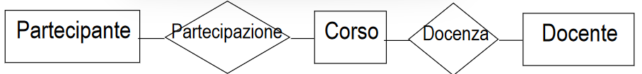

- ## PASSO ITERATIVO
  collapsed:: true
	- si ripete per tutti i sottoschemi (se presenti), fino a che ogni specifica è rappresentata
		- 1. raffinare i concetti sulla base delle specifiche
		  2. aggiungere nuovi concetti alo schema per descrivere specifiche non ancora descritte
- ## PASSO DI INTEGRAZIONE
  collapsed:: true
	- si esegue solo se sono presenti diversi sotto-schemi
	- 1. integrare i vari sotto-schemi in uno schema generale facendo riferimento allo schema scheletro
- ## ANALISI DELLA QUALITA' DELLO SCHEMA
  collapsed:: true
	- 1. verificare **correttezza** dello schema anche se ristrutturato (significato dai requisiti alla realizzazione)
	  2. verificare la **completezza** dello schema, eventualmente ristrutturato
-
- # ESEMPIO PROGETTAZIONE CONCETTUALE
	- **ASSUNZIONE**: già eseguita l'analisi dei requisiti della quale è derivato il seguente schema scheletro
	- 
	- #+BEGIN_NOTE
	  non si devono fare considerazioni di basso livello
	  #+END_NOTE
	- #+BEGIN_TIP
	  Si segue la strategia ibrida
	  #+END_TIP
	- si ha una società di formazione che deve memorizzare dati dei partecipanti, corsi e docenti
	- ### PASSAGGIO DI RAFFINAMENTO
	- **PASSO ITERATIVO**
		- si trovano 3 tipologie di partecipanti figlie dell'entità partecipanti:
			- professionista
			- dipendente pubblico
			- dipendente privato
		-