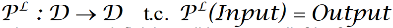

- overloading: si crea una funzione con stesso nome ma che varia il tipo dei dati di input
- paradigma imperativo: con strutture di controllo, variabili
- paradigma funzionale:
- paradigma logico: non esistono variabili e strutture di controllo (es. prolog)
- ## Macchine astratte e implementazione dei linguaggi di programmazione
	- implementare un linguaggio di programmazione è strettamente correlato a quello di **macchina astratta**
	- ((64006c03-8d93-424a-86a8-ef291cb51ee4))
	- correttezza lessicale: appartenenza di una stringa ad un dato dizionario e/o regole di composizione
	- **calcolatore**=macchina fisica
		- consente di eseguire algoritmi opportunamente formalizzati per essere comprensibili all'esecutore
		- la formalizzazione consiste nella codifica degli algoritmi in un certo linguaggio *L* definito da opportuna sintassi
	- **macchina astratta per L** :
		- *M_{L}*
		- un insieme di algoritmi e strutture dati per memorizzare ed eseguire i programmi scritti per quel dato linguaggio
		- è composta da:
			- memoria per conservare dati e SW
			- interprete per eseguire istruzioni contenute in programmi
	- **linguaggio macchina**:
		- linguaggio compreso dall'interprete di quella macchina
		- data una macchina astratta M_{L}, il linguaggio *L* compreso dall'interprete di M_{L} è detto linguaggio macchina
- ### MACCHINA ASTRATTA
	- {:height 295, :width 386}
	- **OPERAZIONI DELL'INTERPRETE**
	  collapsed:: true
		- operazioni per **l'elaborazione** dei dati **primitivi** (num interi, reali, op aritm)
		- operazioni e strutture dati per il **controllo** della **seq di exe**
			- gestione flusso di controllo delle istruzioni
			- strutture per memorizzare l'indirizzo
		- operazioni di **input** e **output**
			- gestione del flusso dati da memoria all'interprete e viceversa
		- operazioni e strutture per la **gestione della memoria**
			- relative all'allocazione di memoria per dati e SW
	- **CICLO DI ESECUZIONE DEL GENERICO INTERPRETE**
	  collapsed:: true
		- {:height 352, :width 461}
	- **REALIZZAZIONE DI UNA MACCHINA ASTRATTA**:
	  collapsed:: true
		- 2 possibili soluzioni
			- **realizzazione fisica, in HW**
			  background-color:: green
			  collapsed:: true
				- gli algoritmi M_{L} sono realizzati con dispositivi fisici
			- **realizzazione SW** (livelli intermedi tra M_{L} e il dispositivo fisico)
			  background-color:: green
				- **simulazione SW**
				  background-color:: yellow
				  collapsed:: true
					- algoritmi e strutture dati di M_{L} realizzati in un altro linguaggio *L'* già implementato
					- M_{L} è realizzata mediante programmi in *L'* che simulano le funzionalità di M_{L}
					- M_{L} è realizzata attraverso la macchina M'_{L'}
					- M'_{L'} è detta **macchina ospite** e si denota con M0_{L0}
						- l'implementazione di L sulla macchina ospite avviene mediante qualche traduzione di *L* in *L0*, a seconda di come avviene il processo di traduzione si ha:
							- **implementazione interpretativa**
								- si traduce l'istruzione man mano che viene eseguita
							- **implementazione compilativa**
								- trasformazione del programma dal linguaggio direttamente all'assembler
				- **emulazione FW**
				  background-color:: yellow
				  collapsed:: true
					- microprogrammi di basso livello
	- **FUNZIONE PARZIALE**
	  collapsed:: true
		- f: A-->B
		- è una corrispondenza tra elementi dell'insieme A e quelli dell'insieme B
		- Può essere NON DEFINITA per qualche elemento di A
			- Dato a€A, se esiste un corrispondente B, esso è denotato con f(a)
			- IN ALTRE PAROLE: Può essere NON DEFINITA se dato un elemento di quell'insieme non esiste una corrispondenza
	- **DEFINIZIONE DI INTERPRETE**
	  collapsed:: true
		- in generale un SW scritto in *L* si può vedere come una funzione parziale
			- {:height 54, :width 649}
		- si può dare la seguente def di interprete di *L* in *L0*
			- {:height 138, :width 600}
		- non vi è traduzione esplicita di SW scritti in *L*, ma solo un procedimento di decodifica
			- l'interprete, per eseguire un'istruz *i* di *L*, le fa corrispondere ad un insieme di istruz di *L0*. Tale che la **decodifica non è una traduzione esplicita** poiché il codice corrispondente a *i* è eseguito direttamente e non prodotto in uscita
	- **DEFINIZIONE DI COMPILATORE**:
	  collapsed:: true
		- un compliatore da *L* a *L0* è un SW che realizza la funzione
			- 
		- traduzione esplicita dei SW scritti in *L* in SW scritti in *L0* (ospite)
		- per eseguire P^{L} su *Input*, è necessario eseguire C_{L,L0} con P^{L} come input.
		- si avrà come risultato un programma compilato Pc^{L0} scritto in L_{0}, che sarà eseguito su M0_{L0} con il dato in ingresso *Input*
	- **INTERPRETAZIONE vs COMPILAZIONE** pag 18/132
	  collapsed:: true
		- INTERPRETAZIONE:
		  background-color:: yellow
		  collapsed:: true
			- **PRO**: flessibile-->dubugging più semplice
			- **CONTRO**:
				- poco efficiente
				- decodifica dei costrutti a runtime
				- decodifica di uno stesso comando ripetuto (in cicli)
		- COMPILAZIONE:
		  background-color:: yellow
		  collapsed:: true
			- **PRO**: più efficiente (decodifica dell'istruzione fatta una sola volta)
			- **CONTRO**:
				- più rigido (perdita di informazioni rispetto al programma sorgente, debuging difficile)
	- **GERARCHIHA DI MACCHINE ASTRATTE**
	  collapsed:: true
		- si pensi ad una gerarchia di macchine astratte M_{L0}, M_{L1}, ..., M_{Ln}
		- M_{Li} è implementata sfruttando il linguaggio della macchina sottostante M_{Li-1}
		- M_{Li} fornisce a sua volta il proprio linguaggio alla macchina sovrastante M_{Li+1}
		- **indipendenza tra livelli**
			- modifiche interne alle funzionalità si un livello non hanno influenza su altri livelli
		- {:height 202, :width 231}
	- **PROGRAMMI E FUNZIONI CALCOLABILI**:
	  collapsed:: true
		- una funzione parziale f:A-->B è calcolabile nel linguaggio *L* se esiste un programma *P* scritto in *L* tale che:
			- se f(a)=b allora P(a) termina e produce come output *b*
			- se f(a) non è definita allora P con input *a* va in ciclo
	- **IL PROBLEMA DELLA FERMATA (HALT)**
	  collapsed:: true
		- si vuole stabilire se un SW termina su un dato input
			- SW di debugging H
		- H riceve in ingresso qualsiasi programma P scritto nel linguaggio *L* ed un generico input *x* per tale programma
			- {:height 234, :width 473}
	- **INDECIDIBILITA'**
	  collapsed:: true
		- il problema dell'halt è indecidibile
			- non si può costruire un algoritmo che lo risolva
		- esistono prob per i quali non esiste un prog che li risolva?
			- IN ALTRE PAROLE: esistono funzioni non calcolabili?
			- RISPOSTA: SI (un esempio è lo stesso problema dell'halt)
			- ciò è indipendente dal linguaggio adottato, per capirlo si prenda la ((6401d205-684c-4196-8a43-8b121da96121)) e la ((6401d3ab-8555-4224-9fe8-fa7f3176cd63))
	- **MACCHINA DI TOURING**
	  id:: 6401d205-684c-4196-8a43-8b121da96121
	  collapsed:: true
		- astrazione di una macchina generica che è composta da:
			- una testina (CPU)
				- si può spostare a SX e DX o rimanere ferma
				- legge o scrive su una cella per volta
				- gestita da un controllo espresso da un numero finito di stati
			- un nastro potenzialmente infinito suddiviso in celle
		- defintita da una quintupla
			- M=(X,Q, f_{m},f_{d}, δ)
			- **X**=insieme finito di simboli, incluso *blank*, ossia cella vuota
			- **Q**= insieme finito di stati, incluso HALT, ovvero la terminazione
			- **f_{m}**: funzione macchina f_{m}: *Q*x*X*-->*X́́*
			- **f_{d}**: funzione di direzione f_{d}: *Q*x*X*-->{*S,D,F*}
				- determina lo spostamento della testina
				- Sinistra, Destra, Ferma
			- **δ** = funzione di transizione di stato  δ:*Q*x*X*-->*Q*
				- definisce lo stato successivo alla computazione
		- #+BEGIN_NOTE
		  Esempi delle operazioni fatte con la MDT sono posti dalla slide 33/132 alla 91/132 della presentazione "1. introduzione"
		  #+END_NOTE
	- ### Tesi di Church-Turing
	  id:: 6401d3ab-8555-4224-9fe8-fa7f3176cd63
	  collapsed:: true
		- la classe delle funzioni calcolabili coincide con la classe delle funzioni calcolabili dalla MdT
			- ogni funzione calcolabile è calcolata da una mdt
			- non esiste alcun formalismo capace di risolvere una classe dei problemi più ampia di quella che si può risolvere con MDT
		- le funzioni calcolabili realizzate con un qualsiasi linguaggio di programmazione NON sono superiori a quelle realizzabili rispetto a quella di una MDT
	- **MDT vs CPU moderne**
		- {:height 239, :width 466}
	- **Macchina di touring universale**
		- legge dal nastro DATI e SW
		- è una macchina programmabile
		- è un interprete
	- **MDTU e Macchina Von Neumann**
		- inserisci slide 96/132
	- ### RECAP
		- un ling di prog *L* è un formalismo per portare al livello di macchina fisica gli algoritmi
		- la possibilità di risolvere un problema non dipende da *L*
		- tutti i ling di prog sono TURING-COMPLETI
		-
- ## INTRODUZIONE ALLA TEORIA DEI LINGUAGGI FORMALI
	- **Livelli** di descrizione di un linguaggio
		- **grammatica**
			- quali sono frasi corrette?
		- **semantica**
			- cosa significa una frase corretta?
		- **pragmatica**
			- come usare una frase corretta e sensata?
		- **implementazione** (per i ling di prog)
			- come seguire una frase corretta in modo da rispettare il significato?
	- Concetto intuitivo di grammatica
		- alfaveto: simboli per cotruire le parole
		- lessico: parole lecite
		- sintassi: quali sequenze sono frasi legali
		- le grammatiche sono uno strumento utile per descrivere la sintassi di un linguaggio di programmazione
	-