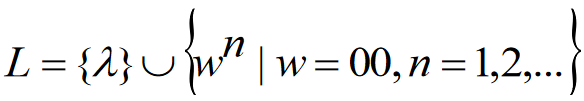
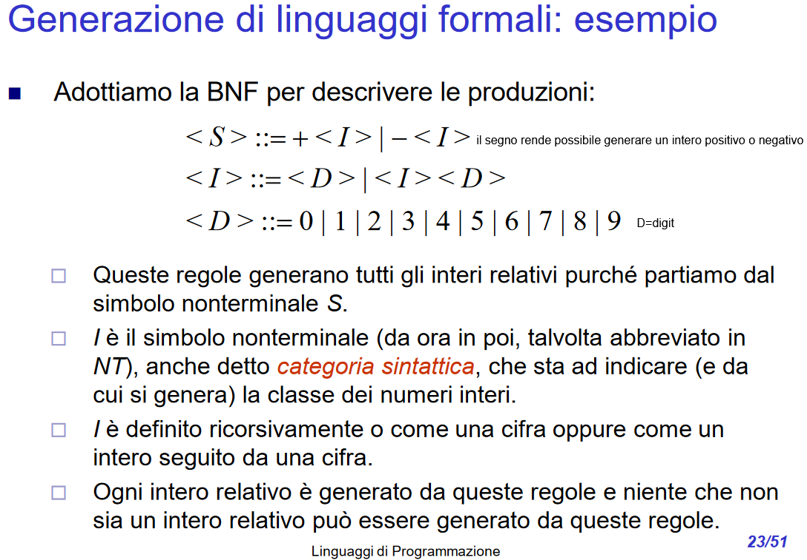
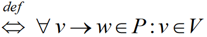
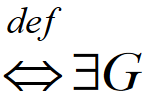
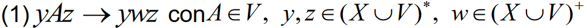
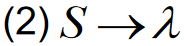
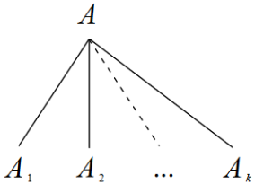
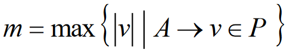
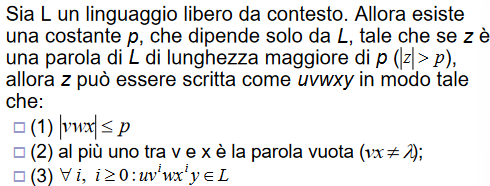

- ## Generazione e riconoscimento di linguaggi formali
	- punto di vista **descrittivo/generativo**
		- un linguaggio può essere definito per elencazione di elementi o per definizione di proprietà che caratterizzano gli elementi
		- ESEMPIO:
			- sia L il linguaggio su *X={0}* costituito da tutte e sole le stringhe che hanno un numero pari di 0, cioè:
				- L={λ, 00, 0000, 000000, ...}
				- la regola di produzione *L* viene espressa come segue
				- {:height 70, :width 347}
	- punto di vista **riconoscitivo**
		- ha l'obiettivo di costruire macchine che data una stringa riconoscano se appartiene al linguaggio *L*
		- produce due risposte, *SI* e *NO*
	- {:height 375, :width 521}
	- per generare un linguaggio sono necessari:
		- **X** = alfabeto dei simboli **terminali** o alfabeto terminale
		- **V** = alfabeto dei simboli **nonterminali** o alfabeto nonterminale o alfabeto delle variabili
		- **S** = simbolo **speciale** (nonterminale), detto assioma o scopo o simbolo distintivo o simbolo di partenza o simbolo **iniziale**
		- **P** = insieme delle **produzioni** dove valgono le seguenti condizioni
			- X∩V=Ø
			- S∈V
	- una **grammatica generativa G**  è una quadrupla G=(X,V,S,P)
- ## Definizione di produzione
  collapsed:: true
	- è una coppia di parole (v,w)
		- **v**=parola sinistra
			- v∈(X∪V)^{+}
			- v contiene un NT<=> v∈(X∪V)^{*} V(X∪V)^{*} W(X∪V)^{*} [e' una concatenazione ]
				- NOTA: W può essere λ
		- **w**=parola destra
	- un elemento (v,w) di P viene comunemente scritto nella forma v-->w
	- una produzione deve riscrivere un NT
- ## Definizione di derivazione o produzione diretta
  collapsed:: true
	- **produzione diretta**: applicazione di **una** regola di produzione per trasformare una parola SX in una DX
	- **derivabilità** o **produzione non diretta**: applicazione di **più** regole di produzione che generano produzioni dirette
	- #+BEGIN_NOTE
	  Il problema di dimostrare la correttezza di una grammatica non è risolubile algoritmicamente, in generale
	  #+END_NOTE
	- in molti casi è possibile dimostrare per induzione che una particolare grammatica genera un particolare linguaggio
- ## Differenza tra linguaggio formale e linguaggio generato da una grammatica
  collapsed:: true
	- linguaggio formale: sottoinsieme di X*
	- linguaggio generato da una grammatica: è un linguaggio generato a partire da un simbolo con le opportune regole
	- regola: prende una parola e ne produce un'altra
	- derivazione diretta: trasformazione di una parola in un'altra attraverso solo una regola che riscrive solo una parte della parola di partenza
- ## Definizione di grammatica libera da contesto
  collapsed:: true
	- una grammatica G=(X,V,S,P) è libera da contesto (o context free o CF) se ∀ produzione *v->w* *v* è un nonterminale
	- G è CF {:height 64, :width 319}
	- un linguaggio L su un alfabeto X è CF se può essere generato da una grammatica libera da contesto
	- L è CF {:height 59, :width 73} libera da contesto tale che L(G)=L
	- se si ha una grammatica CF che genera L, non è detto che non esista un'altra grammatica che generi lo stesso linguaggio
- ## Linguaggi liberi da contesto (se esiste almeno una grammatica CF che lo genera)
  collapsed:: true
	- #+BEGIN_NOTE
	  la maggior parte dei linguaggi di programmazione sono CF
	  #+END_NOTE
	- un NT A in una forma di frase può sempre essere sotituito usando una produzione del tipo A-->ß.
	  collapsed:: true
		- la sostituzioone è sempre valida
	- viceversa se L=L(G) e G non è CF non si può concludere che L non è CF perchè si può escludere che esista una grammatica CF G' per cui L=L(G')
	- **ESEMPI**:
	  collapsed:: true
		- parentesi ben formate
		- numeri interi relativi
		- a^{n}b^{n} |n>0
		- stringhe con ugual numero di 0 e 1
		- a^{n}b^{2n} |n>0
- ## Definizione di grammatica dipendente da contesto
  collapsed:: true
	- una grammatica G(X,V,S,P) è dipendente da contesto (context sensitive o CS) se ogni produzione è in una delle seguenti forme
		- 
			- "A può essere sostituita con w nel contesto y-z" (contesto SX y e DX z)
		- 
			- purché S non compaia nella parte DX di alcuna produzione
- ## Definizione di linguaggio dipendente da contesto
  collapsed:: true
	- un linguaggio L è dipendente da contesto se può essere generato da una grammatica dipendente da contesto
- ## Relazione tra linguaggi CF e CS
  collapsed:: true
	- le regole di produzione CD sono generalizzazione di quelle CF
	- le produzioni CF sono un caso particolare di produzioni di tipo (1) delle grammatiche CS che si verifica quando:
		- y=z=lambda
		- IN ALTRE PAROLE: contesto SX e DX sono equivalenti alla parola vuota (esiste un'eccezione)
		- **ECCEZIONE**
		  id:: 64143e13-341e-4cf2-9e2a-a8e8b6a7ce9b
			- le produzioni CF sono caso partioclare delle produzioni di tipo (1)....
- ## Proposizione
  collapsed:: true
	- la classe dei linguaggi contestuali coincide con la classe dei lingiaggi monotoni
	- tale proposizione deriva immediatamente dal teorema seguente
		- https://elearning.di.uniba.it/pluginfile.php/100151/mod_resource/content/1/3.%20Linguaggi%20CF%20e%20CS.pdf
		- pag da 17 a 20
		-
- ## Albero di derivazione
  collapsed:: true
	- ((641c048b-e32a-4895-9777-f1567a5cd62d))
	- ((641c04e1-55f4-4b72-99f1-f4fec501c651))
	- Sia G=(XVSP) una grammatica CF, un albero di derivazione deve avere le seguenti proprietà
		- 1. la radice è etichettata con il simbolo iniziale S
		  2. ogni nodo interno (nodo non foglia) è etichettato con un simbolo di V (un nonterminale)
		  3. ogni nodo foglia è etichettato con un simbolo di X (terminale) con λ
		  4. se un nodo N è etichettato con A, ed N ha k discendenti diretti N_{1}, N_{2}, ..., N_{k}, etichettati con i simboli A_{1}, A_{2}, ..., A_{k}, rispettivamente, allora la produzione A-->A_{1}, A_{2}, ..., A_{k} deve appartenere a P
		  {:height 137, :width 177} 
		  6. la stringa w può essere ottenuta leggendo (e concatenando) le foglie dell'albero da SX a DX
	- #+BEGIN_NOTE
	  un albero di derivazione non impone l'ordine di applicazione delle produzioni in una derivazione.
	  Quindi, data una derivazione, esiste un solo albero di derivazione; mentre un albero di derivazione rappresenta in generale più derivazioni (in base all'ordine con il quale si espandono i nonterminali)
	  #+END_NOTE
- ## Lemma
  collapsed:: true
	- w=frontiera
	- w^{j}: lunghezza parti destre
	- {:height 73, :width 363}
- ## Pumping lemma per linguaggi liberi da contesto
	- https://www.youtube.com/watch?v=qtnNyUlO6vU&pp=ugMICgJpdBABGAE%3D
	- ENUNCIATO
		- 
		- IPOTESI: L è libera da contesto
		- IMPLICA: che esiste una costante p che dipende solo dal Linguaggio, tale che se z è una parola appartenente al linguaggio di lunghezza maggiore rispetto a p
	- il teorema deve valere in toto per ogni stringa da testare, se anche solo una delle condizioni non è soddisfatta allora il LINGUAGGIO non è CF
	-